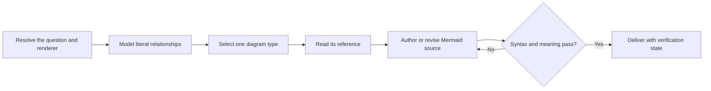

# PTLam Mermaiding

Create, revise, or review Mermaid diagrams so each answers one visual question
with faithful relationships, readable source, valid syntax, and a layout that
survives its target renderer. This skill owns diagram selection and authoring;
the surrounding document owns its argument, prose, and placement.

## How does one visual question become a verified Mermaid diagram?

| Concern                                 | Owner                                            |
| --------------------------------------- | ------------------------------------------------ |
| Facts and relationships                 | Supplied source or authoritative domain evidence |
| Selection, notation, and Mermaid source | This skill and the selected type reference       |
| Feature and version support             | Target Mermaid renderer                          |
| Explanation and document structure      | User or calling skill                            |

Keep reviews read-only. Change files only with user authority; otherwise return
a fenced `mermaid` block.

## 1. Resolve the visual question and target

State the one question the diagram must answer. Then identify:

- who reads it, and how much detail they need;
- the evidence the diagram draws on;
- where it goes, and whether you may write that file;
- the diagram type the user asked for, if any; and
- the target renderer and its Mermaid version.

When the target is unknown, prefer established syntax. When it lacks a requested
type, preserve the visual question in the closest supported type and name the
substitution. The selected type reference owns its exact feature and version
boundary.

Complete this step when the question, audience, evidence, destination,
authority, and compatibility boundary are known or safely constrained.

## 2. Model the literal relationships

List only the objects and relationships needed to answer the question.

| Dimension     | Capture when material                                     |
| ------------- | --------------------------------------------------------- |
| Flow          | Order, causality, branches, loops, concurrency            |
| Structure     | Ownership, handoffs, boundaries, containment, hierarchy   |
| Interaction   | Messages, direction, synchronicity, participant lifetimes |
| Lifecycle     | States, events, guards, entry, terminal conditions        |
| Type and data | Members, associations, cardinality, identity              |
| Work          | Stages, status, assignee, priority, ticket identity       |
| Plot          | Axes, scale, coordinates, placement evidence              |

Keep verified facts, user assumptions, and diagram simplifications distinct.
Omit a missing material fact or mark it in surrounding prose; never invent a
relationship to balance the layout.

Complete this step when every node, edge, group, coordinate, and annotation has
a source or an explicit modeling assumption.

## 3. Select and route one diagram type

Use a requested type when it answers the question faithfully and this catalog
supports it. Otherwise choose from this map, then read the selected reference
before writing or judging source. Each reference owns that type's semantics,
syntax, layout, compatibility, and completion check. For a Mermaid type outside
this catalog, either use the closest supported type and name the substitution or
stop and report that this skill has no maintained contract for it.

| Visual question                                                                      | Type and required reference                |
| ------------------------------------------------------------------------------------ | ------------------------------------------ |
| Who owns each process step and handoff?                                              | [Swimlanes](references/swimlanes.md)       |
| What happens next, branches, depends, or forms a hierarchy without ordered messages? | [Flowchart](references/flowchart.md)       |
| What static types, members, and UML relationships exist?                             | [Class](references/class.md)               |
| How does one thing change state in response to events or conditions?                 | [State](references/state.md)               |
| What data entities, attributes, identities, and cardinalities exist?                 | [ERD](references/erd.md)                   |
| Which participant sends what, and in what order?                                     | [Sequence](references/sequence.md)         |
| Where do items sit on two independent dimensions whose combination matters?          | [Quadrant](references/quadrant.md)         |
| How do ideas radiate from one central concept?                                       | [Mindmap](references/mindmap.md)           |
| What work currently occupies each workflow stage?                                    | [Kanban](references/kanban.md)             |
| Which deployed services and resources connect across boundaries?                     | [Architecture](references/architecture.md) |
| What is nested in a directory-like hierarchy?                                        | [Tree view](references/treeview.md)        |

| Ambiguous choice                                     | Prefer                                                |
| ---------------------------------------------------- | ----------------------------------------------------- |
| Messages over time versus generic flow               | Sequence                                              |
| One entity's lifecycle versus generic flow           | State                                                 |
| Ownership changes versus generic flow                | Swimlanes                                             |
| Deployment topology versus labeled process semantics | Architecture only for topology; flowchart for process |

Split independent visual questions, abstraction levels, or unreadable paths into
separate diagrams with their own question and context.

Complete this step when one type owns each question and every selected type
reference has been read.

## 4. Author the Mermaid source

Apply the selected reference, then these shared rules.

| Concern      | Required authoring behavior                                                                                       |
| ------------ | ----------------------------------------------------------------------------------------------------------------- |
| Identifiers  | Use stable descriptive ids without unexplained abbreviations; separate ids from labels when possible.             |
| Declarations | Declare important objects before relationships.                                                                   |
| Statements   | Put one semantic statement on each line unless indentation defines structure.                                     |
| Text source  | Use four-space nesting, protect grammar-sensitive labels, and add a comment only to explain context you left out. |
| Notation     | Give shape, line, arrow, cardinality, group, and position only the meaning owned by the type reference.           |
| Labels       | Label relationships or conditions that endpoints do not make clear; keep node labels concise.                     |
| Direction    | Use left-to-right for pipelines or time and top-to-bottom for hierarchy unless the domain requires otherwise.     |
| Grouping     | Group only real boundaries, owners, namespaces, or containment.                                                   |
| Density      | Split before using invisible edges, decorative nodes, or dense styling to force layout.                           |
| Styling      | Use the renderer theme by default; style semantic distinctions with reusable classes and more than color.         |
| Icons        | Prefer built-ins; use external packs only after confirming registration.                                          |
| Interaction  | Add links, callbacks, or animation only when requested and supported by target security.                          |

Raw Mermaid source must remain understandable without rendering. Move prose that
does not express a visual relationship into the surrounding document.

Complete this step when the source expresses the literal model, follows the type
reference, and remains readable as text.

## 5. Verify syntax, meaning, and rendering

Run the strongest available check: the destination's Mermaid version, then
installed compatible project tooling, then static source review. Correct every
syntax error and rerun the check. Never claim rendering passed after only static
review.

| Audit           | Pass condition                                                                                        |
| --------------- | ----------------------------------------------------------------------------------------------------- |
| Rendered layout | No clipping, overlap, false proximity, excessive crossing, illegible density, or misleading direction |
| Objects         | Every required object appears once unless repetition is intentional                                   |
| Relationships   | Endpoints, direction, notation, and label match the literal model                                     |
| Semantics       | Boundaries, branches, states, cardinalities, coordinates, and task status match evidence              |
| Styling         | Adds no unsupported meaning                                                                           |
| Type-specific   | The selected reference's completion check passes                                                      |

For a review, report findings by severity with the affected line or construct
and smallest correction. State when no defect was found and whether rendering
was checked.

Complete this step when syntax and meaning pass, rendered layout passes when a
compatible renderer exists, and unavailable verification is named.

## 6. Deliver the diagram

Place each diagram under a heading that states its visual question. Include only
the prose needed for assumptions, substitutions, or verification limits.
Preserve established Markdown and Mermaid frontmatter when editing.

For changed files, report what changed, where, checks used, and what remains
unverified. Complete the task when every diagram is source-traceable, readable
as text, valid under the strongest available check, and fit for its question.
