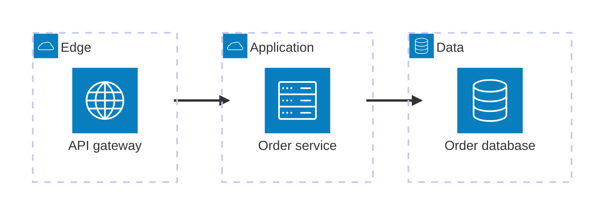

# Architecture

This reference owns Mermaid architecture groups, services, ports, edges,
junctions, and layout constraints for deployed resources across infrastructure
or system boundaries. The shared workflow and acceptance rules remain in
`SKILL.md`.

## Use and compatibility

Use `architecture-beta` for deployment topology, cloud resources, CI/CD
components, and service boundaries. Use a flowchart when the relationships need
edge labels, process order, or decision semantics that architecture syntax
cannot express.

Architecture diagrams require Mermaid 11.1 or later. Built-in icons are `cloud`,
`database`, `disk`, `internet`, and `server`. Use an Iconify icon only after
confirming that the destination registers its icon pack.

## Declare topology before edges

Declare a group before nesting another group or service in it. Use stable,
descriptive lower_snake_case ids because architecture edges reference ids
directly. Keep display labels concise.

```text
group group_id(icon)[Label] in parent_group
service service_id(icon)[Label] in group_id
junction junction_id in group_id
```

Use groups only for real deployment, ownership, network, or trust boundaries.
Use a junction only for a genuine split, merge, or routing point that reduces
ambiguous crossings.

## Route explicit ports

Write each edge with the side it exits and enters: `L`, `R`, `T`, or `B`.

```text
source:R --> L:target
```

Use `-->` for a directed dependency or data path and `--` for an undirected
connection. Do not imply bidirectionality with an undirected line when direction
is known. For a connection that crosses group boundaries, add `{group}` to the
service endpoint; Mermaid does not accept a group id itself as an edge endpoint.

Keep the dominant path on one axis. Choose ports that support that axis and use
90-degree turns only for secondary relationships.

Use `align row` or `align column` only with Mermaid 11.16 or later and only to
correct siblings with equivalent topology. Members must already be declared.
Their order must not contradict edges between them. Prefer the default
deterministic layout; tune seed or force-layout settings only after the topology
is correct.

## Template



## Completion check

Confirm that every group is a real boundary, every service is deployed or
resource-like, every edge uses the correct direction and boundary modifier, and
every icon is built in or registered by the target. Render-check for overlaps;
use compatible alignment directives or split the topology instead of adding
false junctions.
