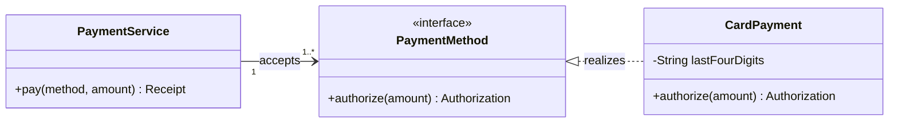

# Class

This reference owns Mermaid class-diagram modeling and notation for static
types, their members, and UML relationships. The shared workflow and acceptance
rules remain in `SKILL.md`.

## Set the modeling level

Choose one level before drawing:

- a conceptual model shows domain types and meaningful associations;
- a design model adds interfaces, important members, and dependencies; and
- an implementation model mirrors verified code signatures and visibility.

Do not mix exhaustive implementation detail into a conceptual diagram. Include
only members that answer the visual question.

## Declare classes and members

Use `classDiagram` and explicit PascalCase class ids. Use
`class StableId["Display label"]` when the rendered name differs. Group several
members inside one `class Name { ... }` block.

Write attributes and methods in the source language's established order when
mirroring code. Otherwise list identity and public contract before internal
details. Parentheses distinguish methods from attributes. Add visibility only
when it is known:

| Prefix | Visibility          |
| ------ | ------------------- |
| `+`    | Public              |
| `-`    | Private             |
| `#`    | Protected           |
| `~`    | Package or internal |

Use `<<interface>>`, `<<abstract>>`, `<<service>>`, or `<<enumeration>>` only
when that classifier is part of the model. Use namespaces only for real package
or domain ownership; relationships still reference class ids.

## Use exact UML relationships

| Syntax                          | Relationship                                          |
| ------------------------------- | ----------------------------------------------------- |
| `Base <\|-- Derived`            | Inheritance                                           |
| `Owner *-- Part`                | Composition; the part's lifetime belongs to the owner |
| `Whole o-- Part`                | Aggregation; the part can exist independently         |
| `Source --> Target`             | Navigable association                                 |
| `Source ..> Target`             | Dependency                                            |
| `Contract <\|.. Implementation` | Realization                                           |
| `Source -- Target`              | Undirected structural link                            |

Label a relationship with a concise verb when its role is not evident. Add
quoted multiplicities beside each endpoint only when cardinality is known. Do
not use composition merely to mean a strong or important association.

Choose `direction LR` for inheritance breadth or dependency chains and
`direction TB` for top-down specialization. Use notes only for a constraint that
cannot be represented by a member or relationship.

## Template

## Completion check

Confirm that the diagram keeps one modeling level, every member and visibility
comes from evidence, every arrow uses its UML meaning, and every multiplicity is
readable from both endpoints. Remove classes that contribute no relationship or
contract to the visual question.
