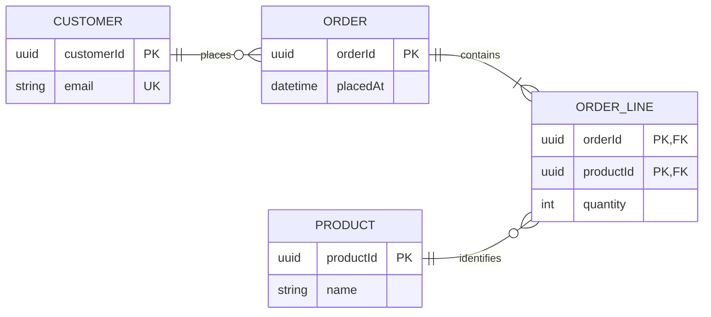

# Entity-relationship diagram

This reference owns Mermaid `erDiagram` modeling and crow's-foot notation for
data entities, attributes, identity, and relationship cardinality. The shared
workflow and acceptance rules remain in `SKILL.md`.

## Choose logical or physical scope

Use singular nouns for entities. Choose one scope:

- a logical ERD shows domain entities, essential attributes, and relationships;
- a physical ERD shows tables, implementation data types, and verified keys.

Do not add foreign-key attributes to a logical ERD merely because a relationship
exists. In a physical ERD, show `PK`, `FK`, and `UK` only when the schema proves
them. Preserve a many-to-many relationship unless the source or requested
physical design contains an associative entity.

## Declare entities and attributes

Use one stable entity naming convention throughout; prefer singular UPPERCASE
ids for a database-oriented model. Use `id["Display label"]` when the rendered
label differs. Inside an entity block, write `type attributeName` followed by an
optional verified key and a short quoted comment.

Mermaid accepts implementation-specific type strings, but they must not imply
precision absent from the source. Use a `?` suffix for a verified optional or
nullable type only after rendering it with the target version; otherwise record
nullability in a short attribute comment.

## Encode both cardinalities

Read a relationship from the first entity's perspective and label it with a
present-tense verb:

```text
CUSTOMER ||--o{ ORDER : places
```

| Marker at an endpoint | Cardinality  |
| --------------------- | ------------ |
| `o\|` or `\|o`        | Zero or one  |
| `\|\|`                | Exactly one  |
| `o{` or `}o`          | Zero or more |
| `\|{` or `}\|`        | One or more  |

Use `--` for an identifying relationship, where the child cannot exist without
the parent's identity. Use `..` for a non-identifying relationship. Do not
choose the line style for decoration.

Choose `direction LR` for a relationship chain and `direction TB` for layered or
domain-grouped data. Use subgraphs only for real bounded contexts or schema
ownership, and keep cross-domain relationships explicit.

## Template



## Completion check

Confirm that every entity is singular, the diagram keeps one logical or physical
level, both ends of every relationship match the source cardinality, and every
identifying line reflects identity dependence. Check attribute keys against the
schema and remove foreign-key detail that only duplicates a logical relation.
