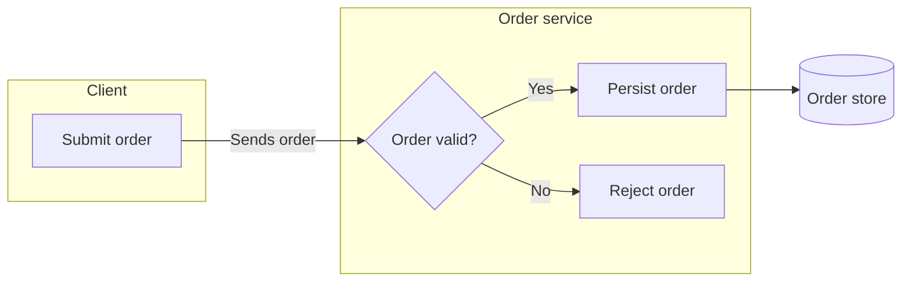

# Flowchart

This reference owns Mermaid flowchart notation for process order, branching,
dependency, hierarchy, and structural overviews without time-ordered messages.
The shared workflow and acceptance rules remain in `SKILL.md`.

## Choose direction and scope

Use `flowchart LR` for pipelines and linear chains. Use `flowchart TD` for
hierarchies, layered architecture, and top-down delegation. Use a bare
`flowchart` only when direction genuinely carries no meaning.

Do not add Mermaid title frontmatter to a flowchart. Let the surrounding
Markdown heading state the visual question.

## Name and shape nodes

Use full descriptive PascalCase ids such as `PaymentAuthorizer`; avoid aliases
such as `PA`. Separate an id from its display label even when Mermaid permits an
implicit label.

Use only the shape needed to distinguish semantics:

| Shape     | Syntax                        | Meaning                             |
| --------- | ----------------------------- | ----------------------------------- |
| Rectangle | `Process["Process"]`          | Default object or action            |
| Diamond   | `Decision{"Valid?"}`          | Decision with routed outcomes       |
| Rounded   | `Retry(["Retry"])`            | Step in a loop or explicit boundary |
| Cylinder  | `OrderStore[("Order store")]` | Persistent storage                  |

Use a Markdown string only for a label that needs a subtitle or controlled line
break. Keep its opening and closing delimiters on separate lines:

```text
Deployment["`
    Deployment
    (Workstation staffing plan)
`"]
```

Quote labels containing punctuation or Mermaid syntax. Avoid the lowercase word
`end` as an unquoted label because the parser can treat it as a block
terminator.

## Connect and group

| Edge    | Meaning                                              |
| ------- | ---------------------------------------------------- |
| `-->`   | Direct action, creation, declaration, or progression |
| `-.->`  | Passive observation or notification                  |
| `<-->`  | Symmetric peer communication                         |
| `<-.->` | Symmetric passive observation                        |

Add a concise verb or condition to an edge when its meaning is not obvious.
Write decision labels from the decision's perspective, such as `Yes`, `No`, or
`Invalid token`. Keep each edge on its own line; avoid Mermaid's chained and `&`
shorthand when it hides individual relationships.

Use a `subgraph StableId["Boundary label"]` only for a real owner, system,
layer, or containment boundary. Indent its contents four spaces. Declare
cross-boundary edges after all affected `end` statements. A subgraph direction
is ignored when its internal nodes connect directly outside, so treat local
direction as a hint rather than a guaranteed layout.

## Template



## Completion check

Confirm that each diamond is a real decision, each outcome is labeled and
accounted for, each dashed edge is passive, and each group is a real boundary.
The rendered flow must follow the declared direction without edge crossings or
spatial arrangements that imply a false relationship.
