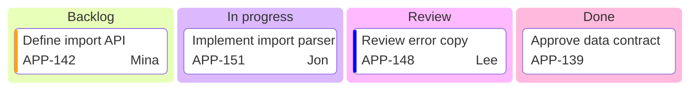

# Kanban

This reference owns Mermaid kanban columns, tasks, and metadata for the work
that currently occupies each workflow stage. The shared workflow and acceptance
rules remain in `SKILL.md`.

## Model a status snapshot

Use `kanban` for the current placement of work, not for the history of how tasks
moved. Order columns from the entry state to the terminal state. Use the team's
actual stage names and include a blocked or exceptional column only when it is a
real workflow state.

Give every column and task a unique stable id followed by a concise display
label. Indent tasks beneath exactly one column. Do not copy a task into several
columns to show dependencies; state dependencies outside the board or use a
flowchart.

## Add only verified metadata

Mermaid supports task metadata in an `@{ ... }` block:

| Key        | Rule                                          |
| ---------- | --------------------------------------------- |
| `assigned` | Use only the current verified assignee        |
| `ticket`   | Preserve the source system's exact ticket id  |
| `priority` | Use `Very High`, `High`, `Low`, or `Very Low` |

Omit missing metadata rather than inserting `Unassigned`, a guessed priority, or
a placeholder ticket. Add `ticketBaseUrl` frontmatter only when the target
ticket system and URL pattern are known. The `#TICKET#` placeholder must expand
to the metadata value.

Keep task labels short enough to scan as cards. Move acceptance criteria and
task descriptions to the surrounding document or linked tracker.

## Template

## Completion check

Confirm that column order matches the actual workflow, every task appears once,
every task's column is current, ids are unique, and all metadata matches its
source. State the snapshot time in surrounding prose when status can change.
