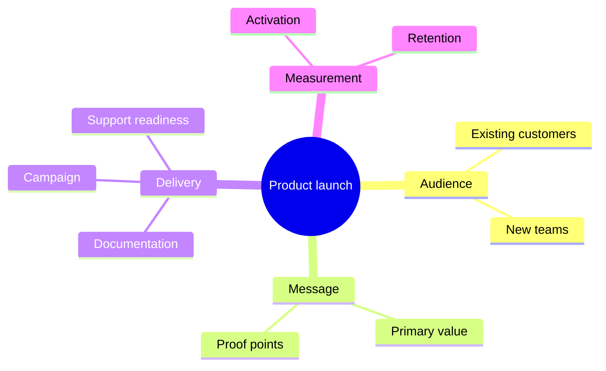

# Mindmap

This reference owns Mermaid mindmap hierarchy and branch design for ideas or
concerns that radiate from one central concept. The shared workflow and
acceptance rules remain in `SKILL.md`.

## Shape the hierarchy

Use `mindmap` with exactly one root. Make the first-level branches parallel
categories, perspectives, or parts of the same whole. Keep sibling labels at a
similar level of abstraction. A dependency chain, lifecycle, or strict directory
hierarchy belongs in another diagram type.

Indent consistently with four spaces per level because indentation defines
parentage. Prefer a shallow map that can be scanned from the center. Split a
branch into another mindmap when its depth or detail overwhelms its siblings.

Use a concise noun phrase for the root and each category. Use action phrases
only when every sibling at that level is an action. Do not repeat the parent's
word in every child unless it prevents ambiguity.

## Apply shapes and annotations

Use the default shape for most nodes and a circle for the root when distinction
helps. Add square, rounded, cloud, bang, or hexagon shapes only when each shape
has a stated semantic role. Decorative shape variety makes the hierarchy harder
to learn.

Use Mermaid Markdown strings for a label that needs a deliberate line break or
emphasis. Use `::icon(...)` and CSS classes only when the destination registers
the required icon fonts and styles. Otherwise keep the map portable and textual.

The tidy-tree layout can improve a wide deterministic hierarchy, but use it only
after confirming the target renderer supports and registers that layout.

## Template

## Completion check

Confirm that there is one root, every child belongs to its parent, sibling
branches are parallel in meaning, and indentation is unambiguous. Remove
cross-branch relationships the mindmap cannot express; use a flowchart or
another diagram when those relationships are material.
