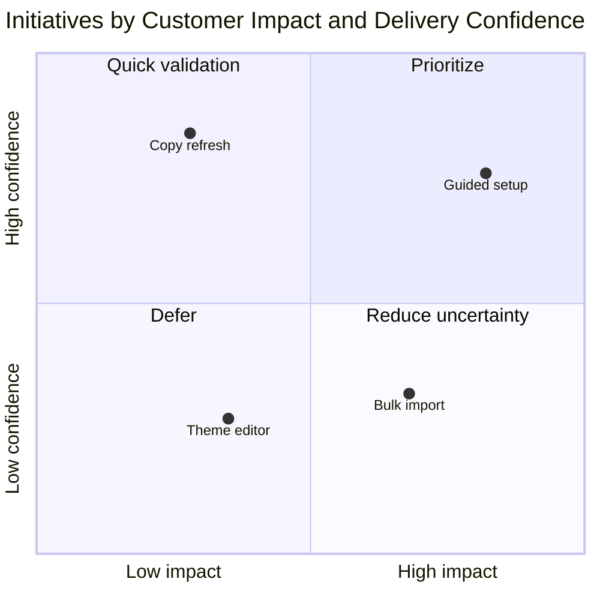

# Quadrant

This reference owns Mermaid quadrant axes, labels, coordinates, and evidence
rules for comparing items on two independent dimensions whose combination
carries meaning. The shared workflow and acceptance rules remain in `SKILL.md`.

## Define the comparison before plotting

Use `quadrantChart` only when both axes describe independent, ordered
dimensions. Write the x-axis from low or left to high or right. Write the y-axis
from low or bottom to high or top. Avoid axes whose endpoints mix several
criteria.

Give the chart a specific `title`, both endpoint labels for each axis, and four
quadrant labels. Name quadrant labels after the interpretation or action implied
by that combination. Mermaid numbers quadrants clockwise from the top right:

| Quadrant     | Position     |
| ------------ | ------------ |
| `quadrant-1` | Top right    |
| `quadrant-2` | Top left     |
| `quadrant-3` | Bottom left  |
| `quadrant-4` | Bottom right |

## Ground the coordinates

Plot each point as `Label: [x, y]` with both coordinates between `0` and `1`.
Normalize measured values consistently or define a qualitative scoring rubric
before assigning coordinates. Keep raw measures or rubric results available in
the surrounding text when the placement may be challenged.

Do not invent decimal precision. For ordinal evidence, use a small set of
clearly separated positions and state that placement is approximate. Do not use
jitter to prevent label overlap if it changes the item's meaning; shorten labels
or split the chart instead.

Use point classes or direct styling only to encode a third verified category.
Keep that category visible through more than color when the destination permits.

## Template

## Completion check

Confirm that the axes are independent and oriented correctly, each coordinate is
traceable to a measure or declared rubric, every point lies within `0..1`, and
each quadrant label matches its location. Flag qualitative coordinates as
approximate rather than presenting them as measurements.
