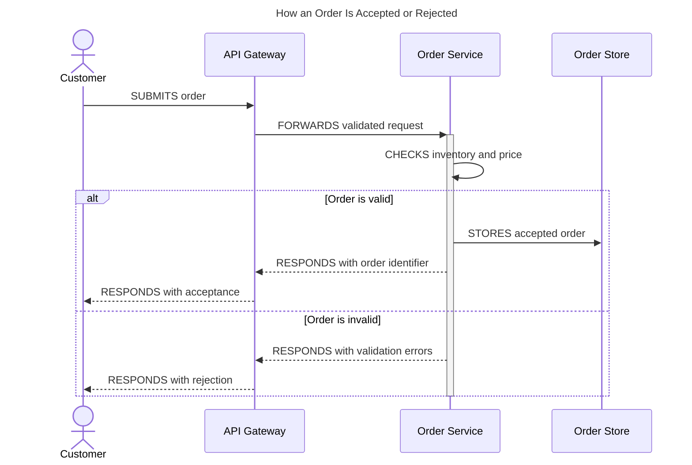

# Sequence

This reference owns Mermaid sequence-diagram participants, messages, temporal
blocks, and phase separation for showing who sends what, to whom, and in what
order. The shared workflow and acceptance rules remain in `SKILL.md`.

## Title and participants

Give every sequence diagram a descriptive surrounding heading. Add matching
Mermaid title frontmatter only when the target renderer supports frontmatter and
the destination benefits from a title inside the rendered surface. A generic
title such as `Sequence diagram` fails because it cannot distinguish diagrams
when a section contains several phases.

Declare participants before messages and order them left to right along the main
data flow. For watch or notification flows, place the watched authority to the
left of its watchers. Use full PascalCase aliases without abbreviations. Use
`actor` only for a human. Use `participant` for systems unless a verified target
benefits from Mermaid's optional boundary, control, entity, database,
collection, or queue stereotypes.

Use this label form when a human role and technical component both matter:

```text
participant OrderService as Order coordinator<br>(Order Service)
```

## Write semantic messages

Begin every message with a precise ALL-CAPS verb. Prefer `SUBMITS`, `REQUESTS`,
`SENDS`, `FORWARDS`, `CHECKS`, `CREATES`, `UPDATES`, `STORES`, `REPORTS`,
`RESPONDS`, `NOTIFIES`, `RECONCILES`, `CONFIGURES`, or a more accurate domain
verb.

| Arrow               | Meaning                                                |
| ------------------- | ------------------------------------------------------ |
| `->>`               | Active command, call, write, send, or local processing |
| `-->>`              | Passive notification, event, status push, or response  |
| `-)`                | Asynchronous send when that distinction matters        |
| `->>+` then `-->>-` | Explicit request-response activation pair              |

Use a self-message for internal processing. Use activations only when their
start and end are meaningful and balanced. Add `<br>` before a parenthetical
clarifier instead of turning one message into a paragraph.

## Structure time explicitly

Use `loop` for repetition, `alt` and `else` for mutually exclusive outcomes,
`opt` for an optional path, `par` and `and` for concurrency, `critical` for a
must-complete region, and `break` for an exception that stops the flow. Indent
messages four spaces inside each block.

Close an activation once, with `deactivate` after the block, rather than on a
response inside every branch. Mermaid walks each branch in turn, so the second
deactivation aborts the whole render.

Use notes for a phase boundary, invariant, or state that messages cannot
express. Do not use notes as a substitute for missing messages.

Split continuous setup from per-request behavior into separate diagrams. Open a
background phase with `Note over ...: Runs continuously in the background` and a
request phase with `Note over ...: Happens per request — ...`. Participants may
differ between phases.

## Template



## Completion check

Confirm that participant order supports the dominant flow, every message has an
active sender, passive events and responses use dashed arrows, activations are
balanced, and every temporal block closes. Split the diagram when background
setup, per-event behavior, or a separate abstraction level obscures chronology.
