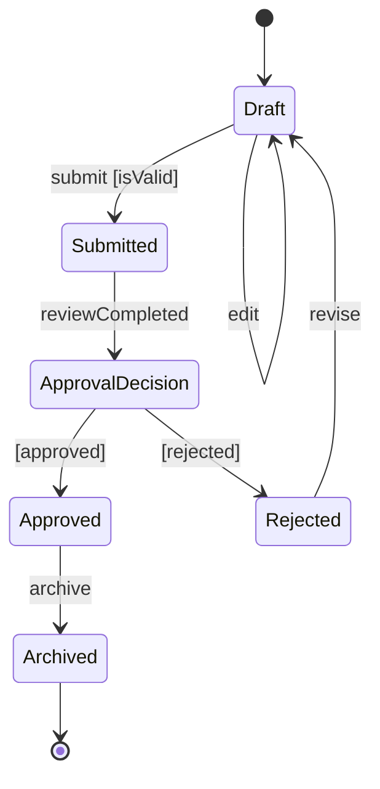

# State

This reference owns Mermaid state-diagram semantics and syntax for how one
subject changes state in response to events or conditions. The shared workflow
and acceptance rules remain in `SKILL.md`.

## Define the lifecycle boundary

Use `stateDiagram-v2`. Name the one subject whose lifecycle the diagram models.
Use states for durable conditions, not actions. Give state ids descriptive
PascalCase names; use `state "Display label" as StableId` when a label needs
spaces.

Add `[*] --> State` only for a real entry state. Add `State --> [*]` only for a
terminal condition. A long-running system does not need a fabricated end state.

## Label transitions

Write `Source --> Target : event [guard] / effect` when all three parts matter.
Use only the parts known from the source. Keep event names active and guard text
boolean. Never put the destination state name in the transition label as a
substitute for the triggering event.

Use a `<<choice>>` pseudostate when one evaluated condition selects among paths.
Label every outgoing choice edge with a mutually understandable guard. Use
`<<fork>>` and `<<join>>` only for concurrent regions that actually begin or
synchronize together.

## Model hierarchy and concurrency

Use a composite `state Name { ... }` when its internal states share one external
lifecycle boundary. Give each composite its own entry and terminal states only
when its internal lifecycle has them. Mermaid cannot transition directly between
internal states in different composite states; route through their composite
boundary or revise the model.

Use `--` inside a composite state for orthogonal concurrent regions. Use a note
only for an invariant, timeout policy, or constraint that cannot be expressed as
a state or transition.

Choose top to bottom for lifecycle progression and left to right for a compact
linear lifecycle. Change direction inside a composite only when it remains
legible in the target renderer.

## Template

## Completion check

Confirm that every node is a condition rather than an action, every transition
has a real trigger or is intentionally unlabeled, choice guards cover the known
outcomes, and entry or terminal markers reflect the actual lifecycle. Trace each
reachable state and flag unintended dead ends or impossible transitions.
