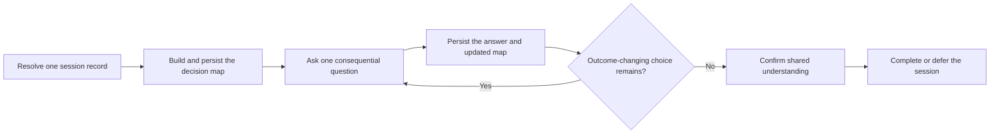

# PTLam Grilling

Stress-test a plan, decision, or idea through one consequential user-owned
choice at a time. The agent resolves discoverable facts and recommends an
answer; the user owns each outcome-changing decision.

Every session has one persisted record so another agent can resume from the
latest decision map without relying on chat history.

## Required skills

### `ptlam-modeling-domain`

**Reason:** Keeps contested business language and context boundaries durable while the interview is still resolving them.

**Instructions:** Read ptlam-modeling-domain before the interview loop.
Apply it when a business term is contested, overloaded, or newly
coined, or when a business context boundary becomes unclear.
Let it own the glossary, context boundaries, and business process map
in CONTEXT.md.
Keep this skill's ownership of the questions, decision map, session
record, and confirmation loop.

Read [ptlam-modeling-domain](skills/ptlam-modeling-domain/SKILL.md).

### `ptlam-creating-adr`

**Reason:** Preserves consequential architectural decisions when the interview makes them concrete enough to evaluate and record.

**Instructions:** Read ptlam-creating-adr before the interview loop.
Apply its qualification gate when a decision becomes expensive to
reverse, constrains future architecture, or carries material rejected
alternatives.
Let it own the ADR qualification verdict, destination, shape, and
verification.
Keep this skill's ownership of the questions, decision map, session
record, and confirmation loop.

Read [ptlam-creating-adr](skills/ptlam-creating-adr/SKILL.md).

## How does one unresolved decision become persisted shared understanding?

| Concern      | Boundary                                                                                                   |
| ------------ | ---------------------------------------------------------------------------------------------------------- |
| Decision     | The agent recommends; the user owns every outcome-changing choice.                                         |
| File effect  | This invocation may write its session record, domain context, and qualifying ADRs at their resolved paths. |
| Later action | Implementation, Git operations, and publication require separate authority.                                |
| Done         | The user confirms the persisted decision map, or the record names each deferred choice and consequence.    |

## 1. Resolve the session record

1. Read the [grilling session schema](references/grilling-session-schema.md). It
   defines the fixed workspace root, canonical directory, record shape, and
   status lifecycle.
2. Inspect that directory, the candidate path, and same-topic records.
3. Resume one clear non-complete match unless the user asks to start fresh. If
   several records plausibly match, ask which one to continue.
4. Read a resumed record completely. Recheck drift-prone evidence and continue
   from its next unresolved decision without repeating settled questions.
5. Before the first substantive question, have each injected artifact owner
   resolve the additional destination it owns. Present the session-record path
   and every additional destination together so the user can narrow or refuse
   the write authority before any file is written there. When an exact future
   filename depends on a decision not yet known, disclose the resolved directory
   and naming rule now, then present the exact path before its first write.

Complete this step when the fixed workspace root, schema, one unique new or
resumable path, every possible write destination, prior state, and write
authority are known and disclosed.

## 2. Build the decision map and write the checkpoint

1. State the intended outcome, known constraints, non-goals, and the artifact or
   action the discussion would eventually enable.
2. Inspect repository files, tools, prior decisions, and other available
   evidence. Do not ask the user to retrieve facts that can be checked safely.
3. Map prerequisites, downstream effects, assumptions, conflicts, resolved
   branches, and open user-owned decisions.
4. Separate consequential choices from reversible implementation mechanics.
   Choose and state a reasonable default for low-impact mechanics.
5. Create or update the session record with the current map. For a new session,
   write the initial checkpoint before asking the first substantive question.
   Tell the user the record path after the write succeeds.

If persistence fails, report the path and reason. Do not claim the session is
resumable or ask the next substantive question.

Complete this step when the map contains the outcome, non-goals, constraints,
evidence, prerequisites, assumptions, conflicts, and known choices; the
highest-impact answerable decision is identifiable; and the persisted record
matches that state.

## 3. Interview one decision at a time

1. Select the highest-impact unresolved decision whose prerequisites are known.
2. Ask exactly one question. State why it matters now, the recommended answer
   and rationale, the strongest material alternative, and the main trade-off.
3. Wait for the user's answer before asking another question.
4. Record the answer, then update the map to show what it resolves, changes, or
   invalidates downstream.
5. Challenge contradictions with evidence. Reopen an earlier branch when a new
   answer makes it inconsistent.
6. Persist the checkpoint before yielding with the next substantive question.
7. Continue until every outcome-changing branch is resolved or explicitly
   deferred with an owner and consequence.

Use concrete scenarios and counterexamples when an abstract answer could hide
different interpretations. Recommend decisively, but never present the
recommendation as the user's decision.

Complete this step when no answerable outcome-changing decision remains and the
record reflects every resolved, invalidated, deferred, or open branch.

## 4. Confirm shared understanding

Summarize the outcome, non-goals, resolved decisions, accepted assumptions,
risks, deferred decisions, and next authorized action. Persist that summary, ask
whether it represents the shared understanding, and wait.

If the user corrects it, update the map and resume from the highest-impact open
decision. If the user asks to stop or act before confirmation, persist the
session as `deferred` and report the unresolved decisions and consequences. An
early action request is not confirmation. Treat later implementation as a
separate task with new authority.

Act on the result only after explicit confirmation. Complete the session when
every outcome-changing decision is resolved or explicitly deferred, the user has
confirmed the shared understanding, the confirmation is persisted, and the
status is `complete`.

See [acknowledgements](ACKNOWLEDGEMENTS.md) for the source that inspired this
workflow.
