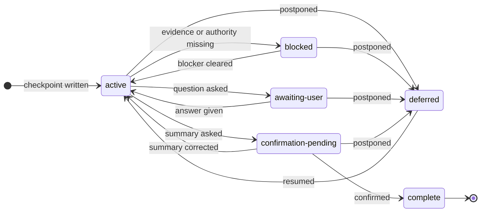

# Grilling session schema

This file owns where a session record lives, what it contains, and when it must
be rewritten. Read it before the first write of any session.

## Where the record lives

Fix the task's initial workspace root and keep it for the whole session. Do not
replace it with a repository root discovered later, or with a shell directory
the session changes into. When the host exposes several workspace roots and
ownership is ambiguous, ask which root should hold the record.

Create new records at:

```text
<workspace-root>/.ptlam-agent-plugin/skills/productivity/ptlam-grilling/<YYYY-MM-DD>_<title>.md
```

Use the session's creation date and a short, filesystem-safe title naming the
decision. Prefer the base filename; otherwise append the first free suffix
before `.md`, such as `_2` or `_3`. Never overwrite or truncate a record.

Invocation authorizes writes to this directory and the selected record, the
domain context resolved by the domain-modeling dependency, and qualifying ADRs
at the ADR dependency's resolved destination. Get separate authority before
staging, committing, publishing, or changing any other project file.

The record stores conclusions and evidence. It never stores a turn transcript,
hidden reasoning, secrets, credentials, or unrelated personal data.

## When to rewrite it

Rewrite the record after a consequential answer or new evidence changes the map,
before yielding with the next substantive question, before any summary or
handoff, and whenever the status changes.

Replace stale state with current conclusions. Never append a transcript. The
record must be understandable without the chat history.

## Structure

Use this structure for every persisted session. Omit a section only when it
truly does not apply. Keep entries concise and replace placeholders with current
session facts.

```markdown
# Grilling session: <descriptive title>

- Status: <active | awaiting-user | confirmation-pending | deferred | blocked |
  complete>
- Created: <timestamp>
- Updated: <timestamp>
- Workspace root: <absolute initial workspace path>

## Outcome and scope

<Intended outcome, eventual artifact or action, constraints, and non-goals.>

## Evidence

<Verified facts with source paths or links and verification dates.>

## Decision map

### Resolved

<User-owned decisions with answers, rationale, and consequences.>

### Assumptions, risks, and contradictions

<Accepted assumptions, current risks, contradictions, and invalidated branches.>

### Deferred

<Deferred decisions with owner and consequence.>

### Open decisions

<Unresolved decisions in dependency order.>

## Current checkpoint

Current question: <question or none> Recommendation:
<answer and rationale or none> Strongest alternative: <alternative or none> Main
trade-off: <consequence or none> Resume from:
<one exact instruction for the next agent>
```

## Status lifecycle

Carry exactly one status, and move it only along an edge of this lifecycle:



`complete` is the only status a later session may not resume.
