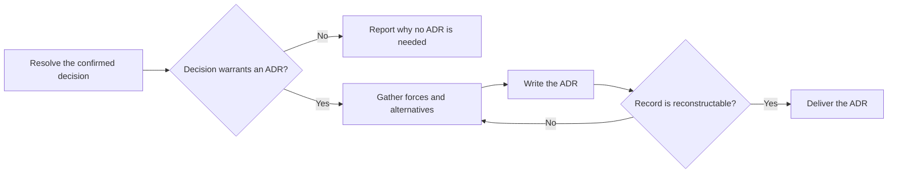

# PTLam Creating Architecture Decision Records

Judge one crystallized architectural choice and write one architecture decision
record (ADR) when the choice warrants durable reasoning. This skill owns the
qualification verdict and ADR; it does not own the interview, implementation, or
Git history.

## Required skills

### `ptlam-explaining`

**Reason:** Makes the decision forces and consequences reconstructable for a future reader without changing the accepted choice.

**Instructions:** Read and apply ptlam-explaining before drafting a qualifying ADR.
Infer the reader's likely difficulty from the confirmed decision and
project evidence; do not start another interview.
Let it own the literal model, explanatory structure, teaching order,
and reconstruction check for unfamiliar or complex content.
Use its explanation package inside the ADR without changing facts,
status, schema, destination, or qualification owned by this skill.
Enter the analogy branch only when the user explicitly requested it.

Read [ptlam-explaining](skills/ptlam-explaining/SKILL.md).

### `ptlam-mermaiding`

**Reason:** Turns material decision forces or architectural effects into verified visuals that make the ADR faster to scan and understand.

**Instructions:** Read ptlam-mermaiding before choosing the ADR's visual form.
Apply it to material sequences, hierarchies, states, dependencies,
interactions, topology, or other relationships; use a table for exact
mappings or comparisons.
Let it own the visual question, diagram type, Mermaid source, and the
strongest available syntax and rendering verification.
Keep this skill's ownership of decision facts, qualification, document
structure, visual placement, destination, and readiness.
Make each visual replace equivalent prose rather than repeat it.

Read [ptlam-mermaiding](skills/ptlam-mermaiding/SKILL.md).

## When does one architectural choice become an ADR?

Only `ptlam-grilling` interviews. Apply this skill after a choice is confirmed;
route an unresolved outcome-changing decision back to the parent decision work.

## 1. Resolve the decision and destination

Name the accepted choice, its owner, source evidence, and the future constraint
it may create. Stop when the choice is still open, contradictory, or missing a
material alternative.

Read applicable `AGENTS.md` files and existing ADR conventions. Use their
destination and numbering when defined; otherwise use the next free four-digit
number at `<project-root>/docs/adr/<NNNN>-<slug>.md`.

A direct user request or parent skill may authorize creating one new ADR and
missing parent directories. Never overwrite an ADR. Changing code, superseding
another record, staging, committing, or publishing requires separate authority.

Complete this step when the confirmed decision, evidence, convention, unique
destination, and file authority are explicit.

## 2. Apply the qualification gate

Write an ADR when the choice materially does at least one of these:

- constrains architecture across components, teams, or release boundaries;
- publishes or changes a contract, data format, identity scheme, or dependency;
- is costly or risky to reverse after adoption;
- lasts beyond the current implementation task; or
- rejects a plausible alternative for a non-obvious trade-off.

A local name, private helper, routine library use, or cheaply reversible
mechanic does not earn an ADR without wider consequences. Return the verdict and
reason without creating a file when the gate fails. A parent workflow persists
that disposition in its own decision record.

Complete this step when the qualifying consequence or the no-ADR reason is
explicit and supported by evidence.

## 3. Gather the decision evidence

Read the confirmed record, relevant product or feature specification, existing
ADRs, repository constraints, and evidence for each considered alternative.
Separate decision drivers, assumptions, rejected alternatives, consequences, and
unknowns.

Do not reconstruct a convenient rationale after the fact. When the accepted
choice lacks enough evidence to explain why it won, stop with the missing input
instead of writing an authoritative record.

Complete this step when a future reader can compare the accepted choice with
each material alternative using the evidence available at decision time.

## 4. Write the ADR

Read [the ADR schema](references/adr-schema.md). It owns the file shape, status,
visual placement, and completion checks.

Keep the decision statement short and put explanatory structure around the
forces, alternatives, and consequences. Record both benefits and liabilities.
Name how a future record supersedes this one; do not edit history silently.

Complete this step when the unique destination contains one accepted ADR and
every schema section has an explicit disposition.

## 5. Verify and deliver

Check the record against its sources and existing ADR convention. Confirm that
the explanation predicts the consequences and each visual preserves the literal
relationships.

Report the qualification verdict, file when created, status, sources, checks,
and unresolved risk.

Complete the task when the no-ADR verdict is supported or the created ADR lets a
future reader reconstruct what was chosen, why, and what it costs.
