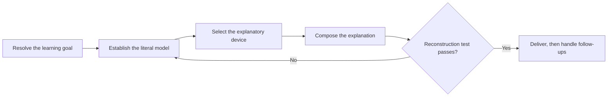

# PTLam Explaining

Build the learner's mental model of one concept, then check they can use it.

## How does one concept become a usable mental model?

## 1. Resolve the learning goal

- the concept to explain;
- what the learner already knows that you can build from;
- the specific mechanism that is confusing;
- the depth, language, and output constraints; and
- any device the learner asked for or ruled out.

Ask only when the concept is missing or too vague to explain accurately. Infer
ordinary presentation choices and continue.

Complete this step when the concept, prior knowledge, confusing mechanism,
depth, language, and requested or excluded devices are known or safely inferred.

## 2. Establish the literal model

Capture the real structure before choosing how to present it:

- essential actors, objects, and boundaries;
- ownership, containment, dependencies, and cardinality;
- inputs, outputs, order, handoffs, and causal rules;
- relevant states, transitions, lifetimes, and failure behavior; and
- exact constraints, facts, and names that must stay literal.

Cover only the mechanism needed at the requested depth. Verify a claim when the
request or the risk requires it. Exclude an uncertain detail rather than
inventing one that makes the explanation tidier.

Complete this step when every material relationship within scope is captured and
uncertain claims are verified or excluded.

## 3. Select the explanatory device

Choose from the learner's difficulty, not from the concept's subject:

| The learner cannot                                                                       | Device                                                             |
| ---------------------------------------------------------------------------------------- | ------------------------------------------------------------------ |
| Picture the mechanism                                                                    | One concrete instance, then generalize from it                     |
| Tell two neighboring concepts apart                                                      | Contrast on the single dimension that separates them               |
| Follow or operate the process                                                            | Walk the causal chain in execution order                           |
| See why it is built this way                                                             | Name the constraint that forced it and the alternative it rejected |
| Hold the whole system in mind                                                            | Whole first, then one level of parts at a time                     |
| Reach the mechanism from anything they already know, and explicitly requested an analogy | One real-life analogy, mapped element by element                   |

Honor a learner-requested device when it preserves the literal model. When it
would distort a material relationship, name the mismatch and choose a faithful
alternative. Combine two devices only when the first leaves a named gap the
second closes.

Select the analogy device only when the learner explicitly asked for an analogy;
a request to explain, define, simplify, or break down a concept is not that ask.
Then follow [the analogy device](references/analogy-device.md), which owns
candidate generation, the mapping gate, the selection turn, and verification.
Without that explicit request, start from one concrete instance and generalize.

Complete this step when one device is selected and any learner-supplied or
learner-excluded device is honored, or refused for a named reason.

## 4. Compose the explanation

Order the material so every sentence is understandable from what came before it:

- Open with the one-sentence literal answer, before any device.
- Build from what the learner already knows toward what they do not.
- Introduce one new idea at a time, and name it where it is first needed.
- Give the simple version first and the precise qualifier immediately after.
- Keep exact facts, names, and constraints literal wherever the device pulls
  toward paraphrase.
- End with what the explanation does not cover.

When the analogy device was selected, compose from
[the analogy explanation shape](references/analogy-explanation-shape.md)
instead. It owns the four components, their order, and their finish condition.

When another skill invokes this one, return one explanation package:

| Field        | Content                                                           |
| ------------ | ----------------------------------------------------------------- |
| Goal         | Learning goal, learner background, confusing mechanism, and depth |
| Presentation | Language and selected explanatory structure                       |
| Model        | Literal answer, literal relationships, and verified constraints   |
| Explanation  | Body in teaching order                                            |
| Limits       | Uncertainty, exclusions, and caveats                              |

Let the caller render these fields without changing their meaning.

Complete this step when the explanation carries no forward reference, every term
is defined where it first appears, and its limits are stated.

## 5. Verify the explanation

Run the reconstruction test: name a case the explanation did not cover, then
check whether its own content predicts the behavior. When it does not, the model
is incomplete — return to step 2 instead of adding more words.

Then confirm that exact facts survived the device intact, and that step 4's
finish condition still holds.

Complete this step when the reconstruction test passes and both checks hold.

## 6. Handle follow-ups

Read [explanation follow-ups](references/follow-ups.md) and apply the branch the
learner selected. It owns the scope change and re-entry point.
