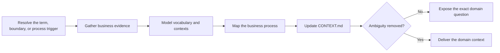

# PTLam Modeling Business Domains

Maintain one project's shared business language, context boundaries, and
business process map in `CONTEXT.md`. This skill owns business meaning; it does
not own source-code types, database schemas, transport models, or serialization.

## Required skills

### `ptlam-mermaiding`

**Reason:** Owns the business process diagram that makes the domain's handoffs and decisions visible without duplicating them in prose.

**Instructions:** Read and apply ptlam-mermaiding for every business process map.
Let it own the visual question, diagram type, notation, Mermaid source,
and strongest available syntax and rendering verification.
Keep this skill's ownership of business facts, vocabulary, context
boundaries, document placement, and glossary verification.
Make the process diagram replace equivalent prose rather than repeat
it.

Read [ptlam-mermaiding](skills/ptlam-mermaiding/SKILL.md).

## How does ambiguous business language become shared context?

Only `ptlam-grilling` interviews. When a domain ambiguity needs a user-owned
decision, return that one exact question to the parent workflow.

Use this skill when a business term is contested, overloaded, or newly coined,
when contexts use one word differently, or when a business process needs a
durable map. Use code-style guidance for code types and persistence mechanics.

## 1. Resolve the trigger and authority

Name the term, context boundary, or business process that triggered the work.
Read applicable `AGENTS.md` files before resolving the project root and
destination. Use their domain-context location when defined; otherwise use
`<project-root>/CONTEXT.md`.

A direct user request or a parent skill may authorize creating or updating the
domain sections in that file. Without file authority, return a proposed patch
and the exact destination. Never overwrite unrelated `CONTEXT.md` content.

Complete this step when the business question, project root, destination,
existing content, and write authority are explicit.

## 2. Gather business evidence

Read the confirmed conversation record, product documents, existing
`CONTEXT.md`, user-facing language, and code only where it reveals current
business usage. Treat code names as evidence, not as definitions.

Separate verified meaning, user-owned decisions, current usage, contradictions,
and assumptions. Search before claiming that a term is shared or that two
contexts differ.

Complete this step when every proposed definition, boundary, process step, and
handoff has a source or is marked as an unresolved domain question.

## 3. Model vocabulary and context boundaries

Give each business term one precise meaning inside one named context. State what
the term does not mean when a neighboring interpretation could recur. When two
contexts legitimately use one word differently, keep both definitions and name
the translation at their boundary.

For each context, state its responsibility, language, invariants, incoming and
outgoing business information, and relationship to other contexts. Keep
technical modules and deployment boundaries out unless they are also verified
business boundaries.

Complete this step when a reader can use every term and cross each context
boundary without guessing which meaning applies.

## 4. Map the business process

Model the process from the business event that starts it through actors,
decisions, handoffs, outcomes, and material exceptions. Show business
responsibility rather than implementation calls.

When an outcome-changing ambiguity remains, expose one exact question to the
parent interview. Outside an interview, record it as open.

Complete this step when the process map accounts for the normal path and each
material branch, or names the evidence needed to finish it.

## 5. Update and verify the context

Read [the domain context schema](references/domain-context-schema.md). It owns
the managed sections, merge rules, and completion checks. Preserve all content
outside those sections.

Report the file or proposed patch, changed terms and boundaries, process-map
verification, open questions, and checks performed.

Complete the task when the managed sections match their evidence and either
remove the triggering ambiguity or expose its one exact unresolved decision.
