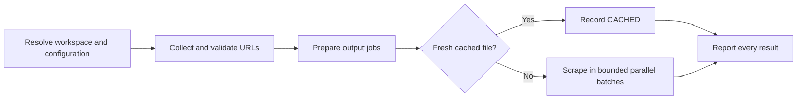

# PTLam Scraping URLs

Batch-scrape HTTP and HTTPS pages into local Markdown files. Accept URLs pasted
in the prompt, a text file of URLs, or both. One failed page never aborts the
remaining queue.

Invocation authorizes creating the workspace-local configuration, the output
directory, and the scraped Markdown files. It does not authorize Git operations,
publication, credential changes, or writes outside those paths.

## How does a URL become an accounted local file?



| Concern           | Owner                                                                      |
| ----------------- | -------------------------------------------------------------------------- |
| Saved defaults    | Workspace-local `CONFIG.yml`                                               |
| One-run overrides | The current user prompt                                                    |
| Page retrieval    | The best available scraper, then the host's web-fetch fallback             |
| File creation     | This invocation, limited to the resolved config and output paths           |
| Done              | Every supplied URL has a reported status, and every successful file exists |

## 1. Resolve the configuration

Read [configuration](references/configuration.md) before resolving any path. It
owns the workspace root, the canonical `CONFIG.yml`, the three keys, and how a
prompt override wins.

Done when the canonical file exists and all three effective values are valid.

## 2. Collect the URL inputs

Accept either input form, without requiring positional arguments:

- **Prompt URLs.** Extract the URLs the user clearly identifies as scrape
  inputs. Accept absolute `http://` and `https://` URLs in prose, lists, or
  Markdown links. Do not treat an incidental citation in the surrounding
  instructions as a scrape input.
- **Input file.** Resolve the user-supplied path from the workspace root unless
  it is absolute. Read one candidate URL per line. Trim whitespace, and ignore
  blank lines and lines whose first non-whitespace character is `#`.

When both forms are present, combine them in prompt-then-file order. Keep every
candidate row. For an exact duplicate after trimming, record `SKIPPED` with a
detail that points to the first candidate; do not queue it again.

Stop with the path and the reason when an explicit input file is missing,
unreadable, or empty after filtering. Record malformed or unsupported candidates
as `SKIPPED`; never turn one into a guessed URL. Stop when no valid HTTP or
HTTPS URL remains.

Done when every candidate is either one normalized input URL or one recorded
`SKIPPED` result.

## 3. Prepare the output jobs

Resolve and authorize `OUTPUT_DIRECTORY` by the configuration contract. Create
it before retrieval, and stop with the filesystem error if creation fails.

When mapping URLs to target files and deciding which targets are already fresh,
read [output files](references/output-files.md). It owns filename derivation,
collision handling, and the cache check that decides which URLs still need
retrieval.

Done when the output directory exists, every valid URL maps to one unique path
inside it, and each one is either `CACHED` or queued once.

## 4. Scrape the queue

Read [retrieval](references/retrieval.md). It owns bounded concurrency, the
fallback, completeness classification, safe replacement, and the JSON result for
each queued URL.

Done when every queued URL has one `OK`, `PARTIAL`, or `FAILED` result, and
every `OK` target exists at the reported non-zero size.

## 5. Report the run

Print one row for every supplied candidate, in the original order:

```markdown
| #   | URL | Status | File | Size | Detail |
| --- | --- | ------ | ---- | ---- | ------ |
```

Use `OK`, `PARTIAL`, `FAILED`, `CACHED`, or `SKIPPED`. Put a concise partial,
failure, or skip reason in `Detail`, and leave it empty for successful and
cached rows. Then report totals as:
`X succeeded, Y partial, Z failed, C cached, S skipped, N supplied.`

Complete the task when the table accounts for every candidate, the totals match
its rows, and every `OK` or `CACHED` path and size has been verified.
