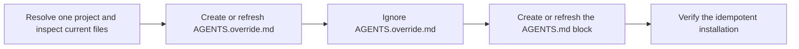

# PTLam Project Setup

Install or refresh PTLam's general agent instructions in one project. Run this
workflow only when the user explicitly asks to initialize or update those
instructions.

The bundled `PTLAM_AGENTS.md` reference is the source of truth for
`AGENTS.override.md`. The override takes precedence over project-specific
guidance in `AGENTS.md` and stays local to the project.

## How are PTLam defaults installed without replacing project rules?



## Managed files

| File                 | Ownership                                                             |
| -------------------- | --------------------------------------------------------------------- |
| `AGENTS.override.md` | Exact local copy of `references/PTLAM_AGENTS.md`, replaced as a whole |
| `.gitignore`         | Project-owned ignores plus the `AGENTS.override.md` entry             |
| `AGENTS.md`          | Project-owned instructions plus one managed precedence block          |

## 1. Resolve the project and current state

1. Resolve one project root from the user's explicit path or the active
   workspace. Never target a home directory or a parent containing several
   projects.
2. Inspect `AGENTS.md`, `AGENTS.override.md`, `.gitignore`, and the working-tree
   state when the project uses version control. Preserve unrelated and
   in-progress changes.
3. Read [PTLam's general agent instructions](references/PTLAM_AGENTS.md) in
   full. That reference owns the exact managed contents of `AGENTS.override.md`.

Complete this step when the project root is unambiguous, all three destination
files have been inspected, and the bundled source is loaded.

## 2. Create or refresh `AGENTS.override.md`

1. When the file is absent, create it as an exact copy of the bundled source.
2. When it already matches byte for byte, leave it unchanged.
3. When it differs, replace the whole file with the bundled source. Do not merge
   or preserve content from the existing file. Project-specific instructions
   belong in `AGENTS.md`.

Complete this step when `AGENTS.override.md` matches the bundled source byte for
byte.

## 3. Ignore `AGENTS.override.md`

1. When `.gitignore` is absent, create it with `AGENTS.override.md` as its only
   entry.
2. When `.gitignore` already contains that exact entry, leave it unchanged.
3. Otherwise, add `AGENTS.override.md` on its own line. Preserve every existing
   ignore rule and comment.
4. When the project uses Git, verify that Git ignores `AGENTS.override.md`. If
   the file is already tracked or a later negation rule makes it visible, report
   that state without changing the index or unrelated ignore rules.

Complete this step when `.gitignore` contains the entry and the final handoff
accounts for any tracked-file or negation conflict.

## 4. Link the override from `AGENTS.md`

Ensure `AGENTS.md` contains exactly one copy of this managed block:

<!-- prettier-ignore -->
```markdown
<!-- PTLAM-SETUP-SKILL:START -->

## AGENTS.override.md has precedence

Read [AGENTS.override.md](AGENTS.override.md). It has precedence over this file.

<!-- PTLAM-SETUP-SKILL:END -->
```

1. When `AGENTS.md` is absent, create it with the canonical block as its entire
   content.
2. Count both the `PTLAM-SETUP-SKILL` marker pair and the legacy `PTLAM-INIT`
   marker pair. Stop on a missing mate, reversed order, duplicate pair, or a
   file that contains both pairs.
3. When the file contains exactly one balanced current or legacy pair, replace
   only that block with the canonical block above.
4. When the file has no marker pair, insert the block after its opening
   level-one heading when present, or at the beginning otherwise.
5. Preserve all content outside the managed block.

Complete this step when `AGENTS.md` contains the canonical block exactly once
and unrelated project guidance remains unchanged.

## 5. Verify and hand off

1. Confirm all three destination files exist at the project root.
2. Confirm `AGENTS.override.md` matches the bundled source byte for byte.
3. Confirm `.gitignore` contains `AGENTS.override.md` and report whether Git
   ignores the file.
4. Confirm the relative link resolves and the managed block matches the
   canonical block byte for byte.
5. Inspect the final diff. Report what changed, where, the checks performed, and
   any tracked-file, negation-rule, or malformed-marker conflict.

Complete the workflow when the three files form an idempotent installation and
project-owned guidance is intact.
