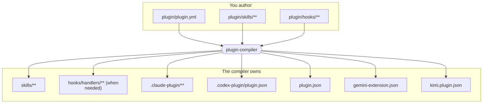

# Agent Plugin Compiler

<p align="center">
  
</p>

**Author once. Validate the graph. Compile every host manifest.**

[](https://www.npmjs.com/package/@fam-tung-lam/ptlam-agent-plugin-compiler)
[](https://github.com/fam-tung-lam/ptlam-agent-plugin-compiler/actions/workflows/ci.yml)
[](https://nodejs.org)
[](https://github.com/fam-tung-lam/ptlam-agent-plugin-compiler/blob/main/LICENSE)

[Docs](https://agent-plugin-compiler.phamtunglam.com/guide/introduction) ·
[Quick Start](https://agent-plugin-compiler.phamtunglam.com/guide/quick-start) ·
[Reference](https://agent-plugin-compiler.phamtunglam.com/reference/)

Markdown-based agent skills have no build step. Agent Plugin Compiler adds one:
declare your skills, dependencies, lifecycle, and portable hooks in a single
manifest, then compile self-contained public skills, a visual catalog, and the
plugin manifests for Claude, Codex, Copilot, Gemini, and Kimi.

Full docs at
[agent-plugin-compiler.phamtunglam.com](https://agent-plugin-compiler.phamtunglam.com).

## What you get

- **A validated skill graph.** Missing, duplicate, self-referencing, circular,
  and invalid lifecycle dependencies fail before generated files change.
- **Complete installable skills.** Every public root recursively carries its
  required skills, generated dependency instructions, frontmatter, and
  supporting files.
- **A reviewable catalog.** `skills/README.md` combines an installable-skill
  table with a Mermaid dependency graph grouped by category and labelled with
  lifecycle status and visibility.
- **Publication and invocation controls.** Visibility and lifecycle metadata
  decide what ships, while schema v2 can mark supported-host workflows for
  explicit invocation only.
- **Portable hooks.** One ordered handler tree maps 19 universal events to each
  selected host where equivalent native semantics exist.
- **Five built-in hosts and an extension seam.** Generate Claude, Codex, GitHub
  Copilot CLI, Gemini CLI, and Kimi Code CLI output, or register a custom
  provider adapter through the Node.js API.
- **Deterministic, bounded output.** Exact ownership, drift detection, atomic
  managed-path writes, and post-write verification make committed output safe to
  review and straightforward to enforce in CI.

## The problem

An agent skill is a directory with a Markdown file in it. That is the whole
format. There is no place to record what a skill depends on, nothing that
resolves a reference, and no build step that fails when a reference goes stale.

Suppose a plugin publishes two skills, and `skill-a` cannot do its job unless
`skill-b` runs first:

```text
skills/
├── skill-a/
│   └── SKILL.md   ← names skill-b, in prose
└── skill-b/
    └── SKILL.md
```

The dependency exists only as sentences inside `skill-a/SKILL.md`:

```markdown
# Skill A

Summarize the release.

Run `skill-b` first to collect the commit facts, because the summary must not
invent them. Pass the table it returns into step 2 unchanged. Its input format
is described in [skill-b](../skill-b/SKILL.md).

1. Read the milestone.
2. Group the commit facts by area.
```

That paragraph hard-codes four separate facts: the other skill's name, why it is
required, how to call it, and where it lives. Nothing checks any of them, and
the same paragraph is copied into every other skill with the same dependency.
Two failures follow.

1. **Users install incomplete skills.** Installers show a flat list. Someone
   installs `skill-a` alone, and its first instruction refers to something they
   do not have. Nothing warned them, because nothing in the directory records
   that `skill-a` is incomplete on its own.
2. **Authors break dependencies silently.** Rename `skill-b` to
   `collect-commit-facts` and the prose is wrong. Nothing fails: not the editor,
   not the tests, not the publish step. The plugin ships, and the agent follows
   an instruction that points at a skill that does not exist. Retiring
   `skill-b`, changing what it returns, or forgetting one of the copies produces
   the same silent result.

In a programming language none of this survives to release: the module system
resolves the import, the compiler rejects the missing symbol, the linter flags
the dead reference. A folder of Markdown files has none of those guarantees, and
neither a human nor an AI agent reliably keeps every hand-written
cross-reference synchronized.

This package supplies the missing guarantees.

## The build step



`plugin/plugin.yml` declares every skill, its visibility, its lifecycle status,
and its dependency edges:

```yaml
skills:
  - id: skill-b
    description: The reusable building block.
    category_id: example
    visibility: internal
    status: active
    required_skills: []

  - id: skill-a
    description: The skill users install.
    category_id: example
    visibility: public
    status: active
    required_skills:
      - skill_id: skill-b
        reason: skill-a cannot produce a correct result without it.
        instructions: Run skill-b first and pass its output forward.

  - id: skill-c
    description: A standalone skill with no dependencies.
    category_id: example
    visibility: public
    status: active
    required_skills: []
```

The same manifest can key ordered handler lists directly by universal event.
Handler paths are relative to `plugin/hooks/`:

```yaml
schema_version: 2

hooks:
  sessionStart:
    - handler: observability/audit.mjs
  userPromptSubmit:
    - handler: observability/audit.mjs
    - handler: simple-logger/request.mjs
  preToolUse:
    - handler: observability/audit.mjs
  postToolUseFailure:
    - handler: observability/audit.mjs
  permissionRequest:
    - handler: observability/audit.mjs
  stop:
    - handler: simple-logger/response.mjs
    - handler: observability/audit.mjs
  setup:
    - handler: observability/audit.mjs
```

The compiler copies those handlers once into `hooks/handlers/**` and translates
each universal event into semantically equivalent provider-native events. Hook
compatibility is evaluated per handler registration: an adapter still compiles
its other output and reports unsupported events as skipped. Hooks do not have a
`required` flag, do not become fallback skills, and do not write provider
instruction files.

Everything under `plugin/` is source you edit. Everything the compiler owns is a
build result — never patch a generated skill or manifest by hand, change the
source and compile again. The compiler always owns the root `skills/` tree.
Under schema v2, the built-in provider adapters also retain stable exact-file
ownership for the files that carry native hook configuration, so removing a hook
cleans stale native output. The compiler owns the shared `hooks/handlers/**`
tree only while at least one selected provider supports an authored event; when
no effective hooks remain, an existing shared handler tree becomes unowned
rather than being deleted. Schema v1 retains its original hook-free ownership.
Every other path stays outside the write plan. Compilation is deterministic, so
the same source always produces the same bytes and `check` can prove that
committed output is current.

Schema v2 also lets an author mark a workflow as manual-only:

```yaml
skills:
  - id: deploy
    description: Deploy the application after explicit user confirmation.
    disable_model_invocation: true
    category_id: engineering
    visibility: public
    status: active
    required_skills: []
```

The compiler emits `disable-model-invocation: true` in the generated skill
frontmatter. Claude Code, GitHub Copilot CLI, and Kimi Code CLI currently honor
the restriction. Codex and Gemini CLI accept the skill but ignore this field, so
they may still select it automatically.

## Dependency instructions are generated

You write `plugin/skills/skill-a/SKILL.md` without mentioning `skill-b` at all:

```markdown
# Skill A

What skill-a does.

<!-- PLUGIN-COMPILER:REQUIRED-SKILLS -->

1. First step.
2. Second step.
```

`compile` produces `skills/skill-a/SKILL.md`:

```markdown
---
name: skill-a
description: The skill users install.
---

# Skill A

What skill-a does.

## Required skills

### `skill-b`

**Reason:** skill-a cannot produce a correct result without it.

**Instructions:** Run skill-b first and pass its output forward.

Read [skill-b](skills/skill-b/SKILL.md).

1. First step.
2. Second step.
```

Frontmatter, the dependency section, and the link are all derived from the
manifest. Rename `skill-b` and every dependent skill is rewritten on the next
compile. Remove it and `validate` fails instead of publishing a dangling
reference. The `<!-- PLUGIN-COMPILER:REQUIRED-SKILLS -->` marker is optional and
only chooses where the section lands.

## Public and internal dependencies

Required skills are copied recursively into every public skill that needs them,
so an installed skill is always complete. Visibility decides whether the
dependency is _also_ published on its own.

`skill-b` as `internal` — a building block, never installed separately:

```text
skills/
├── README.md
├── skill-a/
│   ├── SKILL.md
│   └── skills/
│       └── skill-b/
│           └── SKILL.md
└── skill-c/
    └── SKILL.md
```

`skill-b` as `public` — embedded in `skill-a` _and_ independently installable:

```text
skills/
├── README.md
├── skill-a/
│   ├── SKILL.md
│   └── skills/
│       └── skill-b/
│           └── SKILL.md
├── skill-b/
│   └── SKILL.md
└── skill-c/
    └── SKILL.md
```

Either way, installing `skill-a` alone gets everything it needs.
`skills/README.md` is the generated catalog of published skills. Its Mermaid
dependency graph includes every published root and reachable required skill;
each skill appears in its category subgraph, arrows point from each dependent
skill to its requirement, and each multiline label shows the skill's status and
visibility. Styles also distinguish public, internal, and deprecated skills.
`status` controls publication over time: `active` and `deprecated` skills are
published as root skills, while `draft` and `archived` ones are not.

## Install

### Project dependency

Install the compiler with the plugin project so local development and CI use the
same exact version:

```bash
npm install --save-dev --save-exact \
  @fam-tung-lam/ptlam-agent-plugin-compiler
```

Requires Node.js 22.6 or newer. `--save-exact` pins the stable version resolved
from npm. Recompile after every upgrade.

### Homebrew CLI

Install the stable CLI globally through the PTLam Homebrew tap:

```bash
brew install fam-tung-lam/tap/ptlam-agent-plugin-compiler
```

Homebrew installs the required Node.js runtime. Use `plugin-compiler` directly,
and let Homebrew manage upgrades and removal:

```bash
plugin-compiler --help
brew upgrade fam-tung-lam/tap/ptlam-agent-plugin-compiler
brew uninstall ptlam-agent-plugin-compiler
```

Homebrew follows stable npm releases but updates independently. Prefer the
project dependency above when the compiler version must be committed and
reproduced in CI.

## Quick start

```bash
npm exec -- plugin-compiler init      # scaffold plugin/plugin.yml + example skills
# edit plugin/plugin.yml, plugin/skills/**, and optional plugin/hooks/**
npm exec -- plugin-compiler validate  # check the manifest, sources, and graph
npm exec -- plugin-compiler compile   # write skills/** and host manifests
npm exec -- plugin-compiler check     # confirm output matches the source
```

`init` writes a fully commented, schema-valid starter manifest with the three
skills used above — an internal dependency, a public skill that requires it, and
a standalone public skill. It only creates missing paths, so it is safe to run
again.

`validate` rejects missing, duplicate, self-referencing, and circular
dependencies, plus invalid lifecycle edges: an active skill cannot require a
draft or archived one, and requiring a deprecated skill raises a warning.
`check` writes nothing, reports every managed path that drifted, and exits `1`,
which makes it the command to run in CI.

Full walkthrough, with every file to paste →
[Quick Start](https://agent-plugin-compiler.phamtunglam.com/guide/quick-start).

## Commands

| Command    | Purpose                                                        |
| ---------- | -------------------------------------------------------------- |
| `init`     | Create missing authored source paths, never overwriting        |
| `validate` | Check the manifest, skills, hooks, links, and dependency graph |
| `compile`  | Write shared resources plus selected host manifests and hooks  |
| `check`    | Report managed output that no longer matches authored source   |

`validate`, `compile`, and `check` share
`[--root <path>] [--provider <id>[,<id>...] | --no-providers]`. Without a
provider option the compiler uses the `providers` list in `plugin/plugin.yml`;
`--provider` replaces that list for one run, and `--no-providers` compiles
shared skills only.

Every flag, precedence rule, and exit code →
[CLI reference](https://agent-plugin-compiler.phamtunglam.com/reference/cli).

## Supported hosts

| ID        | Host                 | Generated manifests                                             |
| --------- | -------------------- | --------------------------------------------------------------- |
| `claude`  | Claude plugin        | `.claude-plugin/plugin.json`, `.claude-plugin/marketplace.json` |
| `codex`   | Codex plugin         | `.codex-plugin/plugin.json`                                     |
| `copilot` | GitHub Copilot CLI   | `plugin.json`                                                   |
| `gemini`  | Gemini CLI extension | `gemini-extension.json`                                         |
| `kimi`    | Kimi Code CLI plugin | `kimi.plugin.json`                                              |

Schema v2 accepts the 19 universal hook events documented in the
[manifest reference](https://agent-plugin-compiler.phamtunglam.com/reference/manifest#hook).
Each built-in adapter declares the events for which its host has an equivalent.
Custom adapters expose `supportedHookEvents`; omitted events produce structured,
non-fatal handler-level skips.

Adapter behavior and custom providers →
[Providers](https://agent-plugin-compiler.phamtunglam.com/reference/providers).

## Node.js API

The same pipeline is available programmatically:

```ts
import { AgentPluginCompiler } from "@fam-tung-lam/ptlam-agent-plugin-compiler";

const compiler = new AgentPluginCompiler({ rootDir: process.cwd() });

await compiler.validate();
await compiler.compile();

const { upToDate } = await compiler.check();
```

Pass `providers` to override the manifest selection, or register your own
`ProviderAdapter` to emit a host the compiler does not ship.

Types, options, and a custom adapter example →
[Programmatic usage](https://agent-plugin-compiler.phamtunglam.com/guide/programmatic-usage).

## Documentation

- [Introduction](https://agent-plugin-compiler.phamtunglam.com/guide/introduction)
  — the problem, and the answer to each part of it
- [Skill graph](https://agent-plugin-compiler.phamtunglam.com/guide/skill-graph)
  — dependencies, visibility, and lifecycle status in depth
- [Generated output](https://agent-plugin-compiler.phamtunglam.com/guide/generated-output)
  — which paths the compiler owns and what it writes into them
- [Continuous integration](https://agent-plugin-compiler.phamtunglam.com/guide/continuous-integration)
  — verifying committed output in a build
- [Manifest](https://agent-plugin-compiler.phamtunglam.com/reference/manifest) —
  the source layout and every field of `plugin/plugin.yml`
- [Architecture](https://github.com/fam-tung-lam/ptlam-agent-plugin-compiler/blob/main/docs/ARCHITECTURE.md)
  — internal design, for contributors
- [Changelog](https://github.com/fam-tung-lam/ptlam-agent-plugin-compiler/blob/main/CHANGELOG.md)
  — release notes and breaking changes

## Contributing

Issues and pull requests are welcome. Start with
[CONTRIBUTING.md](https://github.com/fam-tung-lam/ptlam-agent-plugin-compiler/blob/main/CONTRIBUTING.md),
and report vulnerabilities through the
[security policy](https://github.com/fam-tung-lam/ptlam-agent-plugin-compiler/blob/main/SECURITY.md).

---

## License

This project is licensed under the MIT license - see [LICENSE](LICENSE) for
details.
