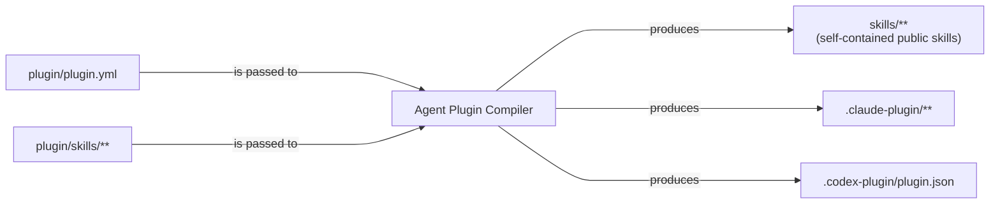

# Agent Plugin Compiler

`@fam-tung-lam/ptlam-agent-plugin-compiler` helps authors build reliable agent
skill plugins.

## Why this package exists

Most skill installers show users a flat list of skills. They do not show that
one skill may need another skill to work.

Imagine a plugin with two skills:

- `prepare-change-plan` creates a plan;
- `inspect-repository` collects the repository facts needed by that plan; and
- `prepare-change-plan` depends on `inspect-repository`.

Without a dependency tool, that simple relationship causes several problems.

### Issue 1: Users can install an incomplete skill

The installer may show both skills, but not the dependency between them. A user
can install `prepare-change-plan` by itself without knowing that
`inspect-repository` is also required. The installed skill then misses part of
the instructions it needs to work.

### Issue 2: Authors can break dependencies without noticing

Agent plugin authors often write the dependency directly into a skill's
instructions: the other skill's name, why it is needed, and how to use it. That
text can silently become wrong when the required skill is renamed, removed,
drafted, archived, or replaced.

Nothing in a plain folder of Markdown files tells the author that another skill
still points to the old dependency. The plugin can be released before anyone
notices the mistake.

### Issue 3: Manual copies drift

Agent plugin authors also have to keep skill metadata, visibility, lifecycle
status, dependency instructions, public skill copies, catalogs, and host
manifests in sync. A person or an AI agent may update all of them sometimes and
miss one at other times. That is not a reliable maintenance process.

### Solution: Agent Plugin Compiler

Compiler replaces those repeated manual steps with one build-time source of
truth:



1. Declare skills in `plugin/skills/` and dependencies in `plugin/plugin.yml`.
2. The compiler validates those relationships, puts each required skill inside
   the skill that needs it
3. Generate the public skill catalog for Claude and Codex from the same source.

Can be used through CLI commands or the `AgentPluginCompiler` Node.js API.

## Features

- **Explicit dependency graph:** each dependency records the required skill, why
  it is needed, and how the parent skill should use it.
- **Early dependency validation:** missing, duplicate, self-referencing,
  circular, and invalid lifecycle relationships fail before publication.
- **Self-contained public skills:** required skills are copied recursively into
  every public root skill that needs them.
- **One source for plugin state:** metadata, visibility, lifecycle status,
  replacements, the public catalog, and provider manifests stay aligned.
- **Generated-state checking:** `check` reports when compiled skills or
  manifests no longer match the authored source.

## Installation

Install the compiler locally in a npm project:

```bash
npm install --save-dev --save-exact \
  @fam-tung-lam/ptlam-agent-plugin-compiler@next
```

## Quick start

### 1. Initialize the authored plugin source

Run `init` from the plugin repository root:

```bash
npm exec -- plugin-compiler init
```

For a new plugin, the command creates a schema-valid, fully commented
`plugin/plugin.yml` with two example categories and three matching example
skills: an internal dependency, a standalone public skill, and a public skill
that uses the dependency. It is safe to run repeatedly: existing paths and
manifest content remain unchanged.

### 2. Customize the authored plugin source

```text
plugin/
├── plugin.yml
└── skills/
    ├── inspect-repository/
    │   └── SKILL.md
    ├── prepare-change-plan/
    │   └── SKILL.md
    └── write-commit-message/
        └── SKILL.md
```

The generated manifest explains every section, marks values to replace with
`TODO` comments, documents the allowed visibility and lifecycle values, and
includes complete standalone and required-skill examples. A customized version
can look like this:

```yaml
schema_version: 1

name: planning-skills
description: Skills for planning repository changes.
version: "1.0.0"

author:
  name: Example Maintainer

homepage: https://github.com/example/planning-skills
repository: https://github.com/example/planning-skills
license: MIT

keywords:
  - agent
  - planning

marketplace:
  name: planning-skills
  description: Skills for planning repository changes.
  plugin_description: Inspect a repository and prepare change plans.
  category: development
  keywords:
    - agent
    - planning

categories:
  - id: engineering
    name: Engineering
    description: Skills for repository work.

skills:
  - id: inspect-repository
    description: Inspect a repository and collect verified facts.
    category_id: engineering
    visibility: internal
    status: active
    required_skills: []

  - id: prepare-change-plan
    description: Prepare a change plan from verified repository facts.
    category_id: engineering
    visibility: public
    status: active
    required_skills:
      - skill_id: inspect-repository
        reason: The plan must reflect the repository's actual structure.
        instructions:
          Inspect the repository and pass the verified facts forward.

  - id: write-commit-message
    description: Write a concise conventional commit message.
    category_id: engineering
    visibility: public
    status: active
    required_skills: []
```

Customize `plugin/skills/inspect-repository/SKILL.md`:

```markdown
# Inspect a repository

Inspect the repository and collect the facts needed to plan a change.

<!-- PLUGIN-COMPILER:REQUIRED-SKILLS -->

1. Read the relevant source and configuration files.
2. Report the current structure and constraints.
```

Customize `plugin/skills/prepare-change-plan/SKILL.md`:

```markdown
# Prepare a change plan

Create a focused implementation plan from verified repository facts.

<!-- PLUGIN-COMPILER:REQUIRED-SKILLS -->

1. Describe the files and behavior that need to change.
2. Keep the plan small and testable.
```

Customize `plugin/skills/write-commit-message/SKILL.md`:

```markdown
# Write a commit message

Write a concise conventional commit message for a completed change.
```

- `<!-- PLUGIN-COMPILER:REQUIRED-SKILLS -->` is an optional placement marker.
  When present, the compiler replaces it with the declared dependency
  instructions. When omitted, those instructions appear after the top-level
  title and introductory paragraphs, before the next top-level block. Without a
  top-level title, they appear at the beginning.
- Do not add YAML frontmatter here; the compiler generates it.

### 3. Run the compiler

`generate` replaces the compiler-owned root `skills/` tree and provider manifest
files.

```bash
npm exec -- plugin-compiler validate
npm exec -- plugin-compiler generate
npm exec -- plugin-compiler check
```

The result is a public skill with its internal dependency included:

```text
skills/
├── README.md
└── prepare-change-plan/
    ├── SKILL.md
    └── skills/
        └── inspect-repository/
            └── SKILL.md
.claude-plugin/
├── marketplace.json
└── plugin.json
.codex-plugin/
└── plugin.json
```

## Command-line interface

| Command                                                                | Purpose                                      |
| ---------------------------------------------------------------------- | -------------------------------------------- |
| `plugin-compiler init [--root <path>]`                                 | Create missing authored source paths         |
| `plugin-compiler validate [--root <path>] [--provider <id>[,<id>...]]` | Validate the manifest, skills, and graph     |
| `plugin-compiler generate [--root <path>] [--provider <id>[,<id>...]]` | Generate and verify all managed output files |
| `plugin-compiler check [--root <path>] [--provider <id>[,<id>...]]`    | Report output that does not match the source |
| `plugin-compiler -h` or `plugin-compiler --help`                       | Show the command overview and global options |
| `plugin-compiler <command> -h` or `--help`                             | Show usage and options for one command       |

Without `--root`, every command uses the current working directory. `init`
accepts only this shared option. For other commands, specify `--provider` once
and separate multiple provider IDs with commas:

```bash
plugin-compiler generate --provider claude,codex
```

Without any provider flags, the compiler selects Claude and Codex.

Root help lists the available commands. Help after `init`, `validate`, `check`,
or `generate` stays focused on that command and its options. The `init` help
lists only `--root` because initialization does not select providers.

## Node.js API

```ts
import {
  AgentPluginCompiler,
  CLAUDE,
  CODEX,
} from "@fam-tung-lam/ptlam-agent-plugin-compiler";

const compiler = new AgentPluginCompiler({
  rootDir: process.cwd(),
  providers: [CLAUDE, CODEX],
});

await compiler.validate();
await compiler.compile();

const result = await compiler.check();
console.log(result.upToDate);
```

Select Claude, Codex, both providers, or an empty list when only the shared
`skills/` tree is needed.

Advanced integrations can supply a per-instance `ProviderAdapterRegistry` to
extend the compiler with another provider adapter. Each registry is immutable
and isolated from other compiler instances; `register` returns a new registry.

```ts
import {
  AgentPluginCompiler,
  ArtifactKind,
  OwnershipKind,
  ProviderAdapterRegistry,
  createPlanFragment,
  createProjectPath,
  createProviderId,
  type ProviderAdapter,
} from "@fam-tung-lam/ptlam-agent-plugin-compiler";

const EXTERNAL = createProviderId("external");
const manifestPath = createProjectPath(".external-plugin/plugin.json");
const externalAdapter = {
  id: EXTERNAL,
  compile: ({ plugin }) =>
    createPlanFragment({
      ownerId: EXTERNAL,
      ownership: {
        kind: OwnershipKind.ExactFiles,
        paths: [manifestPath],
      },
      artifacts: [
        {
          kind: ArtifactKind.File,
          path: manifestPath,
          content: new TextEncoder().encode(
            `${JSON.stringify({ name: plugin.name })}\n`,
          ),
        },
      ],
    }),
} satisfies ProviderAdapter;

const registry = new ProviderAdapterRegistry().register(externalAdapter);
const externalCompiler = new AgentPluginCompiler(
  { rootDir: process.cwd(), providers: [EXTERNAL] },
  registry,
);
```

## Documentation and support

- [Changelog](https://github.com/fam-tung-lam/ptlam-agent-plugin-compiler/blob/main/CHANGELOG.md)
- [Complete example](https://github.com/fam-tung-lam/ptlam-agent-plugin-compiler/tree/main/examples/simple-agent-plugin)
- [Architecture](https://github.com/fam-tung-lam/ptlam-agent-plugin-compiler/blob/main/docs/ARCHITECTURE.md)
- [Contributing](https://github.com/fam-tung-lam/ptlam-agent-plugin-compiler/blob/main/CONTRIBUTING.md)
- [GitHub Issues](https://github.com/fam-tung-lam/ptlam-agent-plugin-compiler/issues)
- [Security policy](https://github.com/fam-tung-lam/ptlam-agent-plugin-compiler/blob/main/SECURITY.md)

## License

[MIT](https://github.com/fam-tung-lam/ptlam-agent-plugin-compiler/blob/main/LICENSE)
