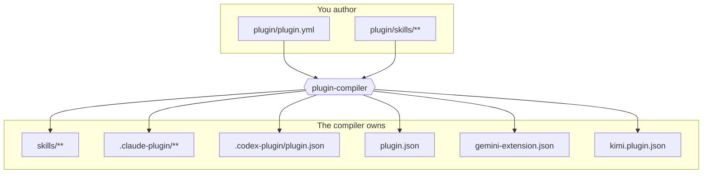

<!-- markdownlint-disable MD013 MD033 MD041 -->
<p align="center">
  
</p>

<h1 align="center">Agent Plugin Compiler</h1>

<p align="center">
  <strong>Author once. Validate the graph. Compile every host manifest.</strong>
</p>

<p align="center">
  <a href="https://www.npmjs.com/package/@fam-tung-lam/ptlam-agent-plugin-compiler"></a>
  <a href="https://github.com/fam-tung-lam/ptlam-agent-plugin-compiler/actions/workflows/ci.yml"></a>
  <a href="https://nodejs.org"></a>
  <a href="https://github.com/fam-tung-lam/ptlam-agent-plugin-compiler/blob/main/LICENSE"></a>
</p>

<p align="center">
  <a href="https://agent-plugin-compiler.phamtunglam.com/guide/introduction">Guide</a> ·
  <a href="https://agent-plugin-compiler.phamtunglam.com/guide/quick-start">Quick Start</a> ·
  <a href="https://agent-plugin-compiler.phamtunglam.com/reference/">Reference</a>
</p>
<!-- markdownlint-enable MD013 MD033 MD041 -->

Markdown-based agent skills have no build step. Agent Plugin Compiler adds one:
declare your skills and their dependencies in a single manifest, and compile
self-contained public skills plus the plugin manifests for Claude, Codex,
Copilot, Gemini, and Kimi.

Full docs at
[agent-plugin-compiler.phamtunglam.com](https://agent-plugin-compiler.phamtunglam.com).

## The problem

Suppose a plugin publishes two skills, and `skill_a` cannot do its job without
`skill_b`:

```text
skills/
├── skill_a/   ← depends on skill_b
└── skill_b/
```

Nothing in that folder records the dependency, which causes two failures.

1. **Users install incomplete skills.** Installers show a flat list. Someone may
   install `skill_a` without `skill_b`, and get broken `skill_a`.
2. **Authors break dependencies silently.** The dependency usually lives inside
   `skill_a/SKILL.md` as prose: the name of `skill_b`, why it is needed, how to
   use it. Rename, archive, or delete `skill_b` and that prose becomes wrong.
   Nothing fails. The plugin ships.

In a programming language none of this survives to release: the module system
resolves the import, the compiler rejects the missing symbol, the linter flags
the dead reference. A folder of Markdown files has none of those guarantees, and
neither a human nor an AI agent reliably keeps every hand-written
cross-reference synchronized.

This package supplies the missing guarantees.

## The build step



`plugin/plugin.yml` declares every skill, its visibility, its lifecycle status,
and its dependency edges:

```yaml
skills:
  - id: skill_b
    description: The reusable building block.
    category_id: example
    visibility: internal
    status: active
    required_skills: []

  - id: skill_a
    description: The skill users install.
    category_id: example
    visibility: public
    status: active
    required_skills:
      - skill_id: skill_b
        reason: skill_a cannot produce a correct result without it.
        instructions: Run skill_b first and pass its output forward.

  - id: skill_c
    description: A standalone skill with no dependencies.
    category_id: example
    visibility: public
    status: active
    required_skills: []
```

Everything under `plugin/` is source you edit. Everything the compiler owns is a
build result — never patch a generated skill or manifest by hand, change the
source and compile again.

## Dependency instructions are generated

You write `plugin/skills/skill_a/SKILL.md` without mentioning `skill_b` at all:

```markdown
# Skill A

What skill_a does.

<!-- PLUGIN-COMPILER:REQUIRED-SKILLS -->

1. First step.
2. Second step.
```

`compile` produces `skills/skill_a/SKILL.md`:

```markdown
---
name: skill_a
description: The skill users install.
---

# Skill A

What skill_a does.

## Required skills

### `skill_b`

**Reason:** skill_a cannot produce a correct result without it.

**Instructions:** Run skill_b first and pass its output forward.

Read [skill_b](skills/skill_b/SKILL.md).

1. First step.
2. Second step.
```

Frontmatter, the dependency section, and the link are all derived from the
manifest. Rename `skill_b` and every dependent skill is rewritten on the next
compile. Remove it and `validate` fails instead of publishing a dangling
reference. The `<!-- PLUGIN-COMPILER:REQUIRED-SKILLS -->` marker is optional and
only chooses where the section lands.

## Public and internal dependencies

Required skills are copied recursively into every public skill that needs them,
so an installed skill is always complete. Visibility decides whether the
dependency is _also_ published on its own.

`skill_b` as `internal` — a building block, never installed separately:

```text
skills/
├── README.md
├── skill_a/
│   ├── SKILL.md
│   └── skills/
│       └── skill_b/
│           └── SKILL.md
└── skill_c/
    └── SKILL.md
```

`skill_b` as `public` — embedded in `skill_a` _and_ independently installable:

```text
skills/
├── README.md
├── skill_a/
│   ├── SKILL.md
│   └── skills/
│       └── skill_b/
│           └── SKILL.md
├── skill_b/
│   └── SKILL.md
└── skill_c/
    └── SKILL.md
```

Either way, installing `skill_a` alone gets everything it needs.
`skills/README.md` is the generated catalog of published skills, and `status`
controls publication over time: `active` and `deprecated` skills are published
as root skills, while `draft` and `archived` ones are not.

## Install

```bash
npm install --save-dev --save-exact \
  @fam-tung-lam/ptlam-agent-plugin-compiler@next
```

Requires Node.js 22.6 or newer. The package is a beta prerelease: pin it exactly
and recompile after every upgrade.

## Quick start

```bash
npm exec -- plugin-compiler init      # scaffold plugin/plugin.yml + example skills
# edit plugin/plugin.yml and plugin/skills/**
npm exec -- plugin-compiler validate  # check the manifest, sources, and graph
npm exec -- plugin-compiler compile   # write skills/** and host manifests
npm exec -- plugin-compiler check     # confirm output matches the source
```

`init` writes a fully commented, schema-valid starter manifest with the three
skills used above — an internal dependency, a public skill that requires it, and
a standalone public skill. It only creates missing paths, so it is safe to run
again.

`validate` rejects missing, duplicate, self-referencing, and circular
dependencies, plus invalid lifecycle edges: an active skill cannot require a
draft or archived one, and requiring a deprecated skill raises a warning.
`check` writes nothing and reports every managed path that drifted, which makes
it the command to run in CI.

Full walkthrough →
[Quick Start](https://agent-plugin-compiler.phamtunglam.com/guide/quick-start).

## Commands

| Command    | Purpose                                                        |
| ---------- | -------------------------------------------------------------- |
| `init`     | Create missing authored source paths, never overwriting        |
| `validate` | Check the manifest, skill sources, links, and dependency graph |
| `compile`  | Write the shared skill tree and the selected host manifests    |
| `check`    | Report output that no longer matches the source                |

`validate`, `compile`, and `check` share
`[--root <path>] [--provider <id>[,<id>...] | --no-providers]`. Without a
provider option the compiler uses the `providers` list in `plugin/plugin.yml`;
`--provider` replaces that list for one run, and `--no-providers` compiles
shared skills only.

Every flag, precedence rule, and exit code →
[CLI reference](https://agent-plugin-compiler.phamtunglam.com/reference/cli).

## Supported hosts

| ID        | Host                 | Generated manifests                                             |
| --------- | -------------------- | --------------------------------------------------------------- |
| `claude`  | Claude plugin        | `.claude-plugin/plugin.json`, `.claude-plugin/marketplace.json` |
| `codex`   | Codex plugin         | `.codex-plugin/plugin.json`                                     |
| `copilot` | GitHub Copilot CLI   | `plugin.json`                                                   |
| `gemini`  | Gemini CLI extension | `gemini-extension.json`                                         |
| `kimi`    | Kimi Code CLI plugin | `kimi.plugin.json`                                              |

Adapter behavior and custom providers →
[Providers](https://agent-plugin-compiler.phamtunglam.com/reference/providers).

## Node.js API

The same pipeline is available programmatically:

```ts
import { AgentPluginCompiler } from "@fam-tung-lam/ptlam-agent-plugin-compiler";

const compiler = new AgentPluginCompiler({ rootDir: process.cwd() });

await compiler.validate();
await compiler.compile();

const { upToDate } = await compiler.check();
```

Pass `providers` to override the manifest selection, or register your own
`ProviderAdapter` to emit a host the compiler does not ship.

Types, options, and a custom adapter example →
[Node.js interface](https://agent-plugin-compiler.phamtunglam.com/reference/node-interface).

## Documentation

- [Manifest](https://agent-plugin-compiler.phamtunglam.com/reference/manifest) —
  every field of `plugin/plugin.yml`
- [Authored source](https://agent-plugin-compiler.phamtunglam.com/guide/authored-source)
  — how skills, dependencies, and lifecycle values are declared
- [Generated output](https://agent-plugin-compiler.phamtunglam.com/guide/generated-output)
  — what the compiler owns and how ownership is enforced
- [Architecture](https://github.com/fam-tung-lam/ptlam-agent-plugin-compiler/blob/main/docs/ARCHITECTURE.md)
  — internal design, for contributors
- [Changelog](https://github.com/fam-tung-lam/ptlam-agent-plugin-compiler/blob/main/CHANGELOG.md)
  — release notes and breaking changes

## Contributing

Issues and pull requests are welcome. Start with
[CONTRIBUTING.md](https://github.com/fam-tung-lam/ptlam-agent-plugin-compiler/blob/main/CONTRIBUTING.md),
and report vulnerabilities through the
[security policy](https://github.com/fam-tung-lam/ptlam-agent-plugin-compiler/blob/main/SECURITY.md).

---

## License

This project is licensed under the MIT license - see [LICENSE](LICENSE) for
details.
