# Architecture

The Agent Plugin Compiler turns one authored plugin into checked, repeatable
Claude and Codex files. It validates and compiles files; it does not install or
publish plugins.

## System flow

```mermaid
flowchart LR
  User[CLI or Node.js caller] --> Compiler[Compiler]
  Compiler --> Reader[Filesystem reader]
  Reader --> Source[Authored source snapshot]
  Source --> Core[Core validation and compilation]
  Core --> Model[Validated plugin]
  Model --> Shared[Shared skills compiler]
  Model --> Providers[Claude and Codex providers]
  Shared --> Plan[Output plan]
  Providers --> Plan
  Plan --> Check{Operation}
  Check -->|check| Current[Read current outputs]
  Check -->|generate| Writer[Write managed outputs]
  Writer --> Current
  Current --> Compare[Compare plan with disk]
  Compare --> Result[Operation result]
```

The same output plan is used by `check` and `generate`. This keeps dry checks
and written files aligned.

## Main components

| Component  | Main job                                                        | Depends on                  |
| ---------- | --------------------------------------------------------------- | --------------------------- |
| CLI        | Parse commands, choose both providers, and print results        | Compiler                    |
| Compiler   | Run validation, planning, checking, and generation              | Core, Providers, Filesystem |
| Core       | Parse, validate, compile, plan, and compare without disk access | Nothing outside Core        |
| Providers  | Turn a validated plugin into host-specific files                | Core                        |
| Filesystem | Read safe snapshots and write managed files                     | Core models                 |

The package root exports only `PluginCompiler` and its result types. The five
components above are private and are not supported package subpaths.

## Core models

| Model                                  | Meaning                                                      |
| -------------------------------------- | ------------------------------------------------------------ |
| `PluginSource`                         | Raw manifest, skill files, and resource bytes read from disk |
| `Plugin` and `Skill`                   | Parsed manifest data before all rules have passed            |
| `ValidatedPlugin` and `ValidatedSkill` | Frozen data safe for compilation                             |
| `OutputFragment`                       | Files owned by the shared compiler or one provider           |
| `OutputPlan`                           | All expected files for the selected providers                |
| `OutputState`                          | Current managed files found on disk                          |
| `OutputDifference`                     | A missing, unexpected, changed, or wrong-kind path           |
| Operation result                       | Validated data, warnings, differences, and write details     |

`plugin/plugin.yml` uses schema version 1. It holds plugin details, categories,
skills, status, visibility, and required-skill links. Each skill has a matching
`plugin/skills/<skill-id>/SKILL.md` file and may have `agents`, `assets`,
`references`, or `scripts` resources.

## File ownership

| Path                              | Owner           | Rule                                              |
| --------------------------------- | --------------- | ------------------------------------------------- |
| `plugin/plugin.yml`               | Human           | Main plugin catalog                               |
| `plugin/skills/`                  | Human           | Skill text and resources                          |
| `skills/`                         | Compiler        | Complete managed tree; extra files may be removed |
| `.claude-plugin/plugin.json`      | Claude provider | Exact managed file                                |
| `.claude-plugin/marketplace.json` | Claude provider | Exact managed file                                |
| `.codex-plugin/plugin.json`       | Codex provider  | Exact managed file                                |
| `README.md`                       | Human           | Never read or changed by the compiler             |

Only public active or deprecated skills become roots under `skills/`. Their
required skills are copied below `references/required-skills/` so each output
skill can stand alone.

## Operations

| Operation  | Reads generated files | Writes | Success result               |
| ---------- | --------------------: | -----: | ---------------------------- |
| `validate` |                    No |     No | Authored input is valid      |
| `check`    |                   Yes |     No | Managed files match the plan |
| `generate` |    Yes, after writing |    Yes | Written files match the plan |

All operations first read and validate the authored plugin. Validation covers
the schema, skill graph, lifecycle rules, source layout, resources, and Markdown
links.

## Safety and repeatability

- Paths must stay inside one real repository root.
- Symlinks and unsupported source entries are rejected.
- Plans, warnings, differences, and files use stable ordering.
- Provider order cannot change output bytes.
- Standalone files use a temporary file and atomic rename.
- The `skills/` tree is staged, checked, backed up, swapped, and restored when a
  swap fails.

A full generation is not one disk-wide transaction. If a later write fails, fix
the disk problem and run `generate` again. Run only one compiler operation at a
time for a repository.
