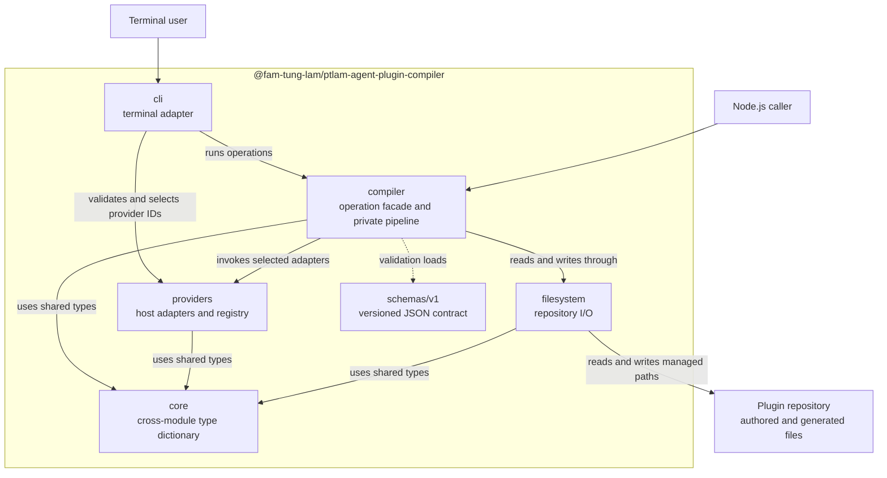
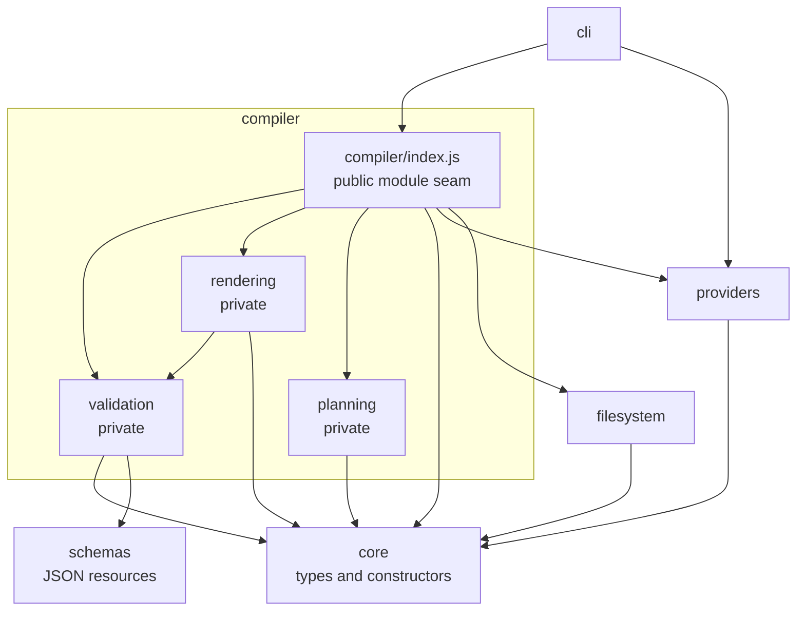
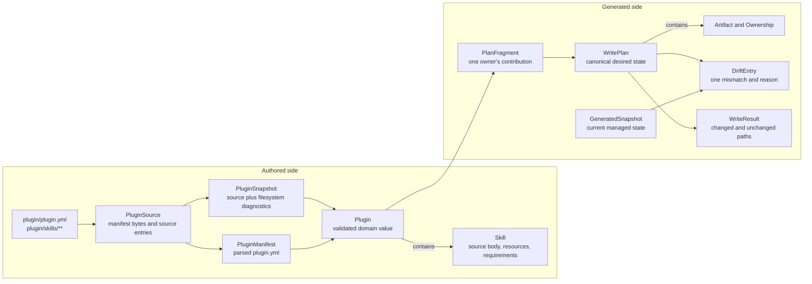
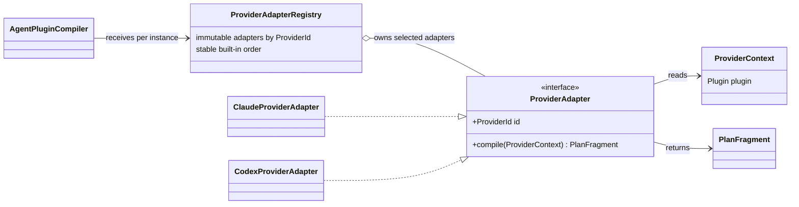
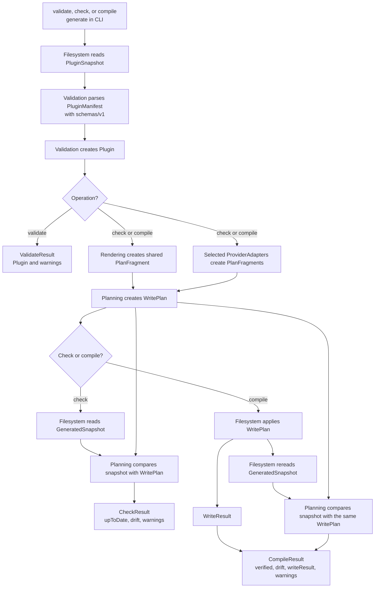

# Architecture

## System at a glance

| Area         | Interface seen by callers                                  | Responsibility                                    | Allowed outgoing module imports                          |
| ------------ | ---------------------------------------------------------- | ------------------------------------------------- | -------------------------------------------------------- |
| `schemas`    | Versioned JSON files                                       | Define the manifest data contract                 | None                                                     |
| `core`       | Immutable cross-module types, interfaces, and constructors | Give the compiler one shared domain vocabulary    | None                                                     |
| `compiler`   | `AgentPluginCompiler.validate`, `.check`, and `.compile`   | Coordinate a complete operation behind one facade | Core, private compiler submodules, Providers, Filesystem |
| `providers`  | Concrete adapters and `ProviderAdapterRegistry`            | Implement and resolve host-specific rendering     | Core                                                     |
| `filesystem` | Source reader, generated-state reader, and plan writer     | Own all repository I/O and safe writes            | Core                                                     |
| `cli`        | Commands, arguments, reports, and exit codes               | Translate terminal input and output               | Compiler, Providers                                      |

- Authored inputs are `plugin/plugin.yml` and `plugin/skills/**`.
- Shared generated outputs are `skills/**` and `skills/README.md`.
- Provider outputs are `.claude-plugin/**` and `.codex-plugin/plugin.json`.
- `src/schemas/v1/plugin-manifest.schema.json` is a versioned data resource, not
  a sixth code module; the build copies it to the same path under `dist/`.
- Root `README.md`, `LICENSE`, and every unowned path remain human-owned.
- The package validates and compiles a repository; it does not install or
  publish plugins.

The compiler is the deep module at the center of the package. Its small
interface hides validation, rendering, planning, provider selection, repository
access, and post-write verification.

## Module seams and dependency rules

| Source module         | May import                                                   | Must not import                                                |
| --------------------- | ------------------------------------------------------------ | -------------------------------------------------------------- |
| `schemas`             | Nothing                                                      | TypeScript modules                                             |
| `core`                | Nothing                                                      | Algorithms, Providers, Filesystem, CLI                         |
| `compiler/validation` | Core, Schemas                                                | Providers, Filesystem, other compiler submodules               |
| `compiler/rendering`  | Core, Compiler Validation                                    | Providers, Filesystem, Compiler Planning                       |
| `compiler/planning`   | Core                                                         | Compiler Validation, Compiler Rendering, Providers, Filesystem |
| `compiler` facade     | Core, all private compiler submodules, Providers, Filesystem | CLI                                                            |
| `providers`           | Core                                                         | Compiler internals, Filesystem, CLI                            |
| `filesystem`          | Core                                                         | Compiler internals, Providers, CLI                             |
| `cli`                 | Compiler facade, Providers                                   | Core, Filesystem, private compiler submodules                  |

| Seam                    | Interface                                     | Hidden implementation                                                          |
| ----------------------- | --------------------------------------------- | ------------------------------------------------------------------------------ |
| Package operation seam  | `AgentPluginCompiler`                         | Operation order and pipeline composition                                       |
| Compiler internal seams | Validation, rendering, and planning functions | Parsing, graph checks, Markdown rendering, plan assembly, and drift comparison |
| Provider seam           | Core's `ProviderAdapter`                      | Registry and Claude/Codex rendering rules                                      |
| Repository seam         | Filesystem readers and writer                 | Path safety, snapshots, atomic file writes, and skills-tree replacement        |
| Terminal seam           | CLI command runner and immutable reports      | Argument parsing, output routing, and process exit handling                    |

- Cross-module TypeScript imports target the module's `index.js`.
- A schema import targets its versioned `.json` file directly; schemas do not
  have a barrel.
- Code outside `compiler/` imports only `compiler/index.js`, never
  `compiler/validation`, `compiler/rendering`, or `compiler/planning`.
- Filesystem imports Core only. Domain algorithms never read from disk.
- Core contains shared types, smart constructors, and the narrow published-skill
  selector; pipeline algorithms live under Compiler.
- `scripts/check-module-boundaries.ts` checks these rules in the normal
  repository gates.

The private compiler submodules exist to give validation, rendering, and
planning strong locality. Their interfaces are internal implementation details,
so callers depend on the facade instead of the pipeline layout.

## Domain model

| Model                              | Meaning                                                                    | Created when                                                            |
| ---------------------------------- | -------------------------------------------------------------------------- | ----------------------------------------------------------------------- |
| `PluginSource`                     | Immutable manifest bytes and authored skill-tree entries                   | Authored paths have been read                                           |
| `PluginSnapshot`                   | Plugin source plus normalized filesystem diagnostics                       | The filesystem read is complete                                         |
| `PluginManifest` / `SkillManifest` | Strictly parsed `plugin.yml` values                                        | YAML and the selected JSON schema pass                                  |
| `Plugin` / `Skill`                 | Immutable, provider-neutral domain values with loaded source and resources | Graph, lifecycle, layout, resources, and Markdown links pass validation |
| `PlanFragment`                     | Artifacts and ownership contributed by shared rendering or one provider    | One producer has rendered its output                                    |
| `WritePlan`                        | Ordered, collision-checked combination of all selected fragments           | Planning accepts every fragment                                         |
| `Artifact` / `Ownership`           | Desired file or tree entry and the paths managed by its owner              | A fragment is constructed                                               |
| `GeneratedSnapshot`                | Current entries read only from paths owned by a write plan                 | Check or post-write verification reads generated state                  |
| `DriftEntry`                       | Missing, unexpected, content-changed, or wrong-kind managed path           | A write plan and generated snapshot differ                              |
| `WriteResult`                      | Managed paths that changed or stayed unchanged                             | Filesystem applies a write plan                                         |

- `PluginManifest` is the typed expression of the public versioned schema
  contract; `Plugin` is the validated domain value used by rendering and
  providers.
- `ProjectPath`, `SkillId`, `CategoryId`, and `ProviderId` are branded strings
  created by smart constructors.
- `SkillId` and `CategoryId` prevent references from being mixed at compile
  time; graph validation still proves that referenced skills exist at runtime.
- Domain constructors follow `XInput -> X`: they normalize, copy mutable values,
  enforce invariants, and freeze the result.
- `WritePlan` and `GeneratedSnapshot` deliberately remain separate: one is
  desired state, the other is observed state, and `DriftEntry` records the
  comparison.

Core is a dictionary shared by two or more modules, not a home for every pure
function. Author-side concepts live under `core/plugin/`; compiler-produced
concepts live under `core/generated/`; identifiers sit between them.

## Provider registry and adapters

| Type                      | Module    | Responsibility                                      | Invariant                                                 |
| ------------------------- | --------- | --------------------------------------------------- | --------------------------------------------------------- |
| `ProviderAdapter`         | Core      | Define host rendering over provider-neutral context | Has one valid `ProviderId` and returns one `PlanFragment` |
| `ProviderContext`         | Core      | Give adapters the validated plugin data they need   | Contains no live filesystem access                        |
| `ClaudeProviderAdapter`   | Providers | Render `.claude-plugin/**`                          | Owns only Claude paths                                    |
| `CodexProviderAdapter`    | Providers | Render `.codex-plugin/plugin.json`                  | Owns only Codex paths                                     |
| `ProviderAdapterRegistry` | Providers | Hold and resolve adapters for one compiler instance | Immutable, unique IDs, deterministic order                |

- `AgentPluginCompiler` accepts a registry and uses a registry with built-ins by
  default.
- Separate compiler instances may use separate registries without shared mutable
  state.
- Registering an adapter returns a new registry and leaves the original
  unchanged.
- CLI provider input is first converted to `ProviderId`, then checked against
  the registry.
- A malformed ID and a well-formed unknown ID are distinct failures; both are
  CLI usage errors with exit code `2`.
- Planning applies fragment integrity, collision, ownership, and path checks to
  every producer, including shared rendering and provider adapters.
- Providers contain host-specific rendering only; operation order remains in
  Compiler.

The seam is open inside the process and has two real adapters. It is not a
separate package or process ABI, and it needs neither an abstract base class nor
a global registry.

## Validate, check, and compile flows

| Operation                     | Repository writes                | Result                                                                | Success condition                                         |
| ----------------------------- | -------------------------------- | --------------------------------------------------------------------- | --------------------------------------------------------- |
| `validate`                    | None                             | `ValidateResult` with `Plugin` and warnings                           | Authored source satisfies schema and domain rules         |
| `check`                       | None                             | `CheckResult` with `upToDate`, `drift`, and warnings                  | Current managed paths equal the complete `WritePlan`      |
| `compile` (`generate` in CLI) | Applies the complete `WritePlan` | `CompileResult` with `verified`, `drift`, `WriteResult`, and warnings | Reread managed paths equal the same plan that was written |

- Every operation reads and validates authored source before using generated
  state.
- Check and compile build the same shared and provider fragments and the same
  `WritePlan`.
- Filesystem reads only paths owned by that plan; unrelated and human-owned
  files are not part of the comparison.
- Compile writes, rereads, and verifies instead of assuming that successful
  writes produced the expected state.
- A filesystem failure may leave some managed paths updated. Fix the problem and
  run compile again; run only one compiler operation at a time for a repository.

Check is the read-only proof of generated state. Compile uses the same plan,
adds managed writes, and reports post-write drift rather than hiding a partial
or externally changed result.
