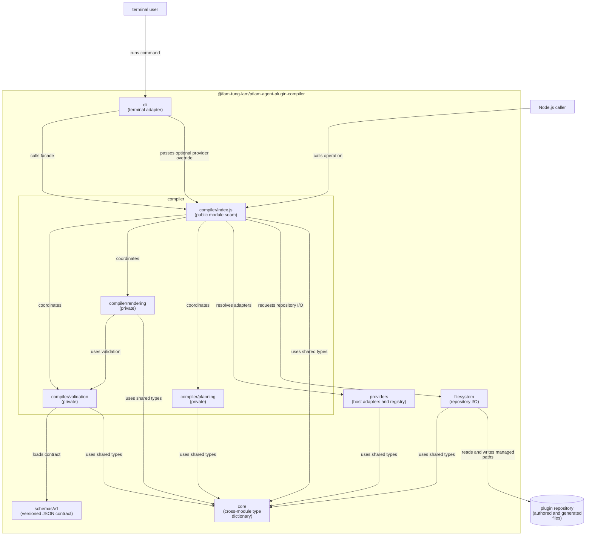
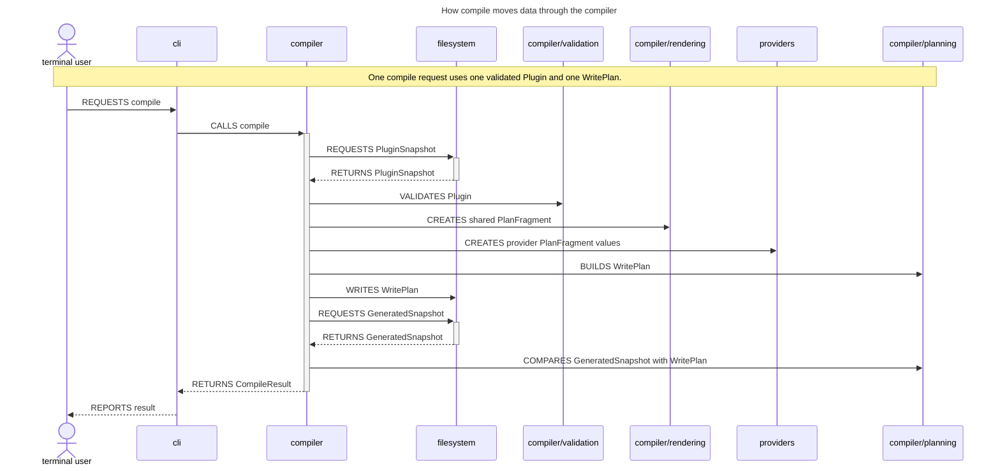
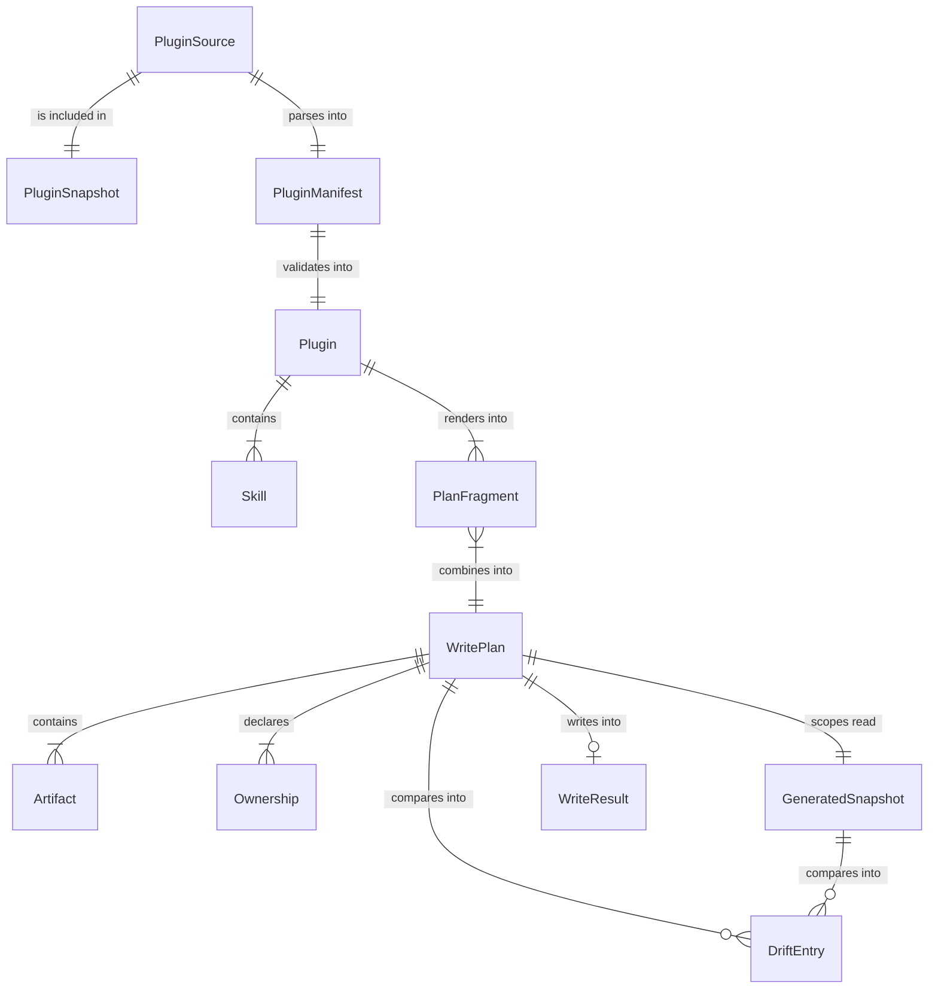
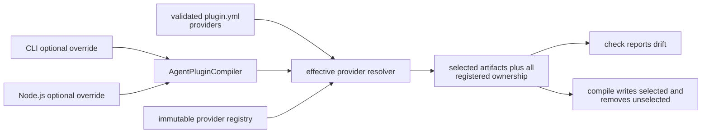
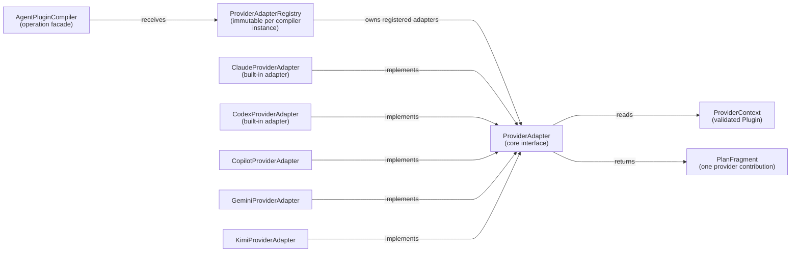

# Architecture

## System at a glance

| Area         | Interface seen by callers                                         | Responsibility                                    | Allowed outgoing module imports                             |
| ------------ | ----------------------------------------------------------------- | ------------------------------------------------- | ----------------------------------------------------------- |
| `schemas`    | Versioned JSON files                                              | Define the manifest data contract                 | None                                                        |
| `core`       | Immutable cross-module types, interfaces, and constructors        | Give the compiler one shared domain vocabulary    | None                                                        |
| `compiler`   | `AgentPluginCompiler.init`, `.validate`, `.check`, and `.compile` | Coordinate a complete operation behind one facade | `core`, private compiler modules, `providers`, `filesystem` |
| `providers`  | Concrete adapters and `ProviderAdapterRegistry`                   | Implement and resolve host-specific rendering     | `core`                                                      |
| `filesystem` | Source initializer, readers, and generated plan writer            | Own all repository I/O and safe writes            | `core`                                                      |
| `cli`        | Commands, arguments, reports, and exit codes                      | Translate terminal input and output               | `compiler`, `providers`                                     |

| Source module         | May import                                                  | Must not import                                                        |
| --------------------- | ----------------------------------------------------------- | ---------------------------------------------------------------------- |
| `schemas`             | Nothing                                                     | TypeScript modules                                                     |
| `core`                | Nothing                                                     | Algorithms, `providers`, `filesystem`, `cli`                           |
| `compiler/validation` | `core`, `schemas`                                           | `providers`, `filesystem`, other private compiler modules              |
| `compiler/rendering`  | `core`, `compiler/validation`                               | `providers`, `filesystem`, `compiler/planning`                         |
| `compiler/planning`   | `core`                                                      | `compiler/validation`, `compiler/rendering`, `providers`, `filesystem` |
| `compiler` facade     | `core`, private compiler modules, `providers`, `filesystem` | `cli`                                                                  |
| `providers`           | `core`                                                      | Private compiler modules, `filesystem`, `cli`                          |
| `filesystem`          | `core`                                                      | Private compiler modules, `providers`, `cli`                           |
| `cli`                 | `compiler` facade, `providers`                              | `core`, `filesystem`, private compiler modules                         |

| Seam                      | Interface                                                                      | Hidden implementation                                                          |
| ------------------------- | ------------------------------------------------------------------------------ | ------------------------------------------------------------------------------ |
| Package operation seam    | `AgentPluginCompiler`                                                          | Operation order and pipeline composition                                       |
| `compiler` internal seams | `compiler/validation`, `compiler/rendering`, and `compiler/planning` functions | Parsing, graph checks, Markdown rendering, plan assembly, and drift comparison |
| Provider seam             | `core`'s `ProviderAdapter`                                                     | Registry and host-specific rendering rules                                     |
| Repository seam           | `filesystem` readers and writer                                                | Path safety, snapshots, atomic file writes, and skills-tree replacement        |
| Terminal seam             | `cli` command runner and immutable reports                                     | Argument parsing, output routing, and process exit handling                    |

- Authored inputs are `plugin/plugin.yml` and `plugin/skills/**`. The manifest's
  required `providers` list is the project-default provider selection.
- Shared generated outputs are `skills/**` and `skills/README.md`.
- Provider outputs are `.claude-plugin/**`, `.codex-plugin/plugin.json`, root
  `plugin.json`, `gemini-extension.json`, and `kimi.plugin.json`.
- `src/schemas/v1/plugin-manifest.schema.json` is a versioned data resource, not
  a code module; the build copies it to the same path under `dist/`.
- Root `README.md`, `LICENSE`, and every unowned path remain human-owned.
- Cross-module TypeScript imports target the module's `index.js`.
- Code outside `compiler/` imports only `compiler/index.js`, never a private
  compiler module.
- `filesystem` imports only `core`. Domain algorithms never read from disk.
- `scripts/check-module-boundaries.ts` checks these rules in the normal
  repository gates.
- The package initializes, validates, and compiles a repository; it does not
  install or publish plugins.

The `compiler` facade is the deep module at the center of the package. Its small
interface hides validation, rendering, planning, provider selection, repository
access, and post-write verification.

## Domain model

| Model                              | Meaning                                                                    | Created when                                                            |
| ---------------------------------- | -------------------------------------------------------------------------- | ----------------------------------------------------------------------- |
| `PluginSource`                     | Immutable manifest bytes and authored skill-tree entries                   | Authored paths have been read                                           |
| `PluginSnapshot`                   | Plugin source plus normalized filesystem diagnostics                       | The `filesystem` read is complete                                       |
| `PluginManifest` / `SkillManifest` | Strictly parsed `plugin.yml` values                                        | YAML and the selected JSON schema pass                                  |
| `Plugin` / `Skill`                 | Immutable, provider-neutral domain values with loaded source and resources | Graph, lifecycle, layout, resources, and Markdown links pass validation |
| `PlanFragment`                     | Artifacts and ownership contributed by shared rendering or one provider    | One producer has rendered its output                                    |
| `WritePlan`                        | Ordered, collision-checked combination of all selected fragments           | Planning accepts every fragment                                         |
| `Artifact` / `Ownership`           | Desired file or tree entry and the paths managed by its owner              | A fragment is constructed                                               |
| `GeneratedSnapshot`                | Current entries read only from paths owned by a write plan                 | Check or post-write verification reads generated state                  |
| `DriftEntry`                       | Missing, unexpected, content-changed, or wrong-kind managed path           | A write plan and generated snapshot differ                              |
| `WriteResult`                      | Managed paths that changed or stayed unchanged                             | `filesystem` applies a write plan                                       |

- `PluginManifest` is the typed expression of the public versioned schema
  contract; `Plugin` is the validated domain value used by rendering and
  providers.
- `ProjectPath`, `SkillId`, `CategoryId`, and `ProviderId` are branded strings
  created by smart constructors.
- `SkillId` and `CategoryId` prevent references from being mixed at compile
  time; graph validation still proves that referenced skills exist at runtime.
- Domain constructors follow `XInput -> X`: they normalize, copy mutable values,
  enforce invariants, and freeze the result.
- `WritePlan` and `GeneratedSnapshot` deliberately remain separate: one is
  desired state, the other is observed state, and `DriftEntry` records the
  comparison.

`core` is a dictionary shared by two or more modules, not a home for every pure
function. Author-side concepts live under `core/plugin/`; compiler-produced
concepts live under `core/generated/`; identifiers sit between them.

## Provider registry and adapters

The compiler resolves providers only after manifest validation. Omitted CLI or
Node.js input uses the manifest list; an explicit list, including `[]`, replaces
it completely. Effective order always follows the registry.

| Type                      | Module      | Responsibility                                      | Invariant                                                 |
| ------------------------- | ----------- | --------------------------------------------------- | --------------------------------------------------------- |
| `ProviderAdapter`         | `core`      | Define host rendering over provider-neutral context | Has one valid `ProviderId` and returns one `PlanFragment` |
| `ProviderContext`         | `core`      | Give adapters the validated plugin data they need   | Contains no live filesystem access                        |
| `ClaudeProviderAdapter`   | `providers` | Render `.claude-plugin/**`                          | Owns only Claude paths                                    |
| `CodexProviderAdapter`    | `providers` | Render `.codex-plugin/plugin.json`                  | Owns only Codex paths                                     |
| `CopilotProviderAdapter`  | `providers` | Render root `plugin.json`                           | Owns only the Copilot manifest                            |
| `GeminiProviderAdapter`   | `providers` | Render root `gemini-extension.json`                 | Owns only the Gemini manifest                             |
| `KimiProviderAdapter`     | `providers` | Render root `kimi.plugin.json`                      | Owns only the Kimi manifest                               |
| `ProviderAdapterRegistry` | `providers` | Hold and resolve adapters for one compiler instance | Immutable, unique IDs, deterministic order                |

- `AgentPluginCompiler` accepts a registry and uses a registry with built-ins by
  default.
- Separate compiler instances may use separate registries without shared mutable
  state.
- Registering an adapter returns a new registry and leaves the original
  unchanged.
- `cli` provider input is first converted to `ProviderId`, then passed to the
  compiler as an optional override. The CLI never reads the manifest.
- Omitting both CLI provider options uses `plugin.yml`; `--provider` is an
  explicit replacement and `--no-providers` is an explicit empty replacement.
- `providers: []` still compiles the shared `skills/` fragment but selects no
  provider artifacts.
- A malformed ID and a well-formed unknown ID are distinct failures; both are
  `cli` usage errors with exit code `2`.
- Every registered adapter contributes its exact-file ownership. Selected
  adapters contribute desired artifacts; registered unselected exact files are
  desired absent. Planning applies integrity, collision, ownership, and path
  checks to every producer, including shared rendering and provider adapters.
- Provider-owned exact paths are stable adapter metadata and must not change
  with plugin fields. Complete-tree provider ownership is rejected before
  planning because an unselected provider is represented by desired-absent exact
  files.
- `providers` contains host-specific rendering only; operation order remains in
  `compiler`.

The seam is open inside the process and has five real adapters. It is not a
separate package or process ABI, and it needs neither an abstract base class nor
a global registry.

## Init, validate, check, and compile flows

### init

```mermaid
---
config:
  htmlLabels: false
---
flowchart LR
    InitCommand["`
        init
        (cli command)
    `"]
    EnsureDirectories["`
        filesystem
        (ensure plugin/ and plugin/skills/)
    `"]
    InspectManifest["`
        filesystem
        (inspect plugin/plugin.yml)
    `"]
    EnsureExampleSkills["`
        filesystem
        (ensure matching example skill sources)
    `"]
    WriteManifest["`
        filesystem
        (create commented plugin/plugin.yml)
    `"]
    InitResult["`
        InitResult
        (created and unchanged paths)
    `"]

    InitCommand ------> EnsureDirectories ------> InspectManifest
    InspectManifest ------>|"`missing`"| EnsureExampleSkills ------> WriteManifest ------> InitResult
    InspectManifest ------>|"`already exists`"| InitResult
```

### validate

```mermaid
---
config:
  htmlLabels: false
---
flowchart LR
    ValidateCommand["`
        validate
        (cli command)
    `"]
    ReadPluginSnapshot["`
        filesystem
        (read PluginSnapshot)
    `"]
    ParsePluginManifest["`
        compiler/validation
        (parse PluginManifest with schemas/v1)
    `"]
    CreatePlugin["`
        compiler/validation
        (create Plugin)
    `"]
    ResolveProviders["`
        compiler
        (resolve manifest or override providers)
    `"]
    ValidateResult["`
        ValidateResult
        (Plugin and warnings)
    `"]

    ValidateCommand ------> ReadPluginSnapshot ------> ParsePluginManifest ------> CreatePlugin ------> ResolveProviders ------> ValidateResult
```

### check

```mermaid
---
config:
  htmlLabels: false
---
flowchart LR
    CheckCommand["`
        check
        (cli command)
    `"]
    ReadPluginSnapshot["`
        filesystem
        (read PluginSnapshot)
    `"]
    CreatePlugin["`
        compiler/validation
        (create Plugin)
    `"]
    ResolveProviders["`
        compiler
        (resolve effective providers)
    `"]
    RenderSharedFragment["`
        compiler/rendering
        (create shared PlanFragment)
    `"]
    RenderProviderFragments["`
        providers
        (create selected PlanFragment values)
    `"]
    BuildWritePlan["`
        compiler/planning
        (build WritePlan)
    `"]
    ReadGeneratedSnapshot["`
        filesystem
        (read GeneratedSnapshot)
    `"]
    CompareWritePlan["`
        compiler/planning
        (compare WritePlan and GeneratedSnapshot)
    `"]
    CheckResult["`
        CheckResult
        (upToDate, drift, and warnings)
    `"]

    CheckCommand ------> ReadPluginSnapshot ------> CreatePlugin
    CreatePlugin ------> ResolveProviders
    ResolveProviders ------> RenderSharedFragment
    ResolveProviders ------> RenderProviderFragments
    RenderSharedFragment ------> BuildWritePlan
    RenderProviderFragments ------> BuildWritePlan
    BuildWritePlan ------> ReadGeneratedSnapshot ------> CompareWritePlan ------> CheckResult
```

### compile

```mermaid
---
config:
  htmlLabels: false
---
flowchart LR
    CompileCommand["`
        compile
        (cli command)
    `"]
    ReadPluginSnapshot["`
        filesystem
        (read PluginSnapshot)
    `"]
    CreatePlugin["`
        compiler/validation
        (create Plugin)
    `"]
    ResolveProviders["`
        compiler
        (resolve effective providers)
    `"]
    RenderSharedFragment["`
        compiler/rendering
        (create shared PlanFragment)
    `"]
    RenderProviderFragments["`
        providers
        (create selected PlanFragment values)
    `"]
    BuildWritePlan["`
        compiler/planning
        (build WritePlan)
    `"]
    ApplyWritePlan["`
        filesystem
        (apply WritePlan)
    `"]
    WriteResult["`
        WriteResult
        (changed and unchanged paths)
    `"]
    RereadGeneratedSnapshot["`
        filesystem
        (reread GeneratedSnapshot)
    `"]
    VerifyWritePlan["`
        compiler/planning
        (compare WritePlan and GeneratedSnapshot)
    `"]
    CompileResult["`
        CompileResult
        (verified, drift, WriteResult, and warnings)
    `"]

    CompileCommand ------> ReadPluginSnapshot ------> CreatePlugin
    CreatePlugin ------> ResolveProviders
    ResolveProviders ------> RenderSharedFragment
    ResolveProviders ------> RenderProviderFragments
    RenderSharedFragment ------> BuildWritePlan
    RenderProviderFragments ------> BuildWritePlan
    BuildWritePlan ------> ApplyWritePlan
    ApplyWritePlan ------> WriteResult
    ApplyWritePlan ------> RereadGeneratedSnapshot ------> VerifyWritePlan ------> CompileResult
    WriteResult ------> CompileResult
```

| Operation  | Repository writes                | Result                                                                           | Success condition                                         |
| ---------- | -------------------------------- | -------------------------------------------------------------------------------- | --------------------------------------------------------- |
| `init`     | Creates missing authored paths   | `InitResult` with created and unchanged paths                                    | Base paths exist; a new manifest has matching examples    |
| `validate` | None                             | `ValidateResult` with `Plugin`, effective providers, source, and warnings        | Authored source and selection satisfy validation          |
| `check`    | None                             | `CheckResult` with selection, `upToDate`, `drift`, and warnings                  | Current managed paths equal the complete `WritePlan`      |
| `compile`  | Applies the complete `WritePlan` | `CompileResult` with selection, `verified`, `drift`, `WriteResult`, and warnings | Reread managed paths equal the same plan that was written |

- Init creates only missing authored paths and never replaces existing content.
- Validate, check, and compile read and validate authored source before using
  generated state.
- Validate, check, and compile expose immutable effective providers and whether
  they came from the manifest or an override.
- Check and compile build the same shared and provider fragments and the same
  `WritePlan`.
- `filesystem` reads only paths owned by that plan, including registered
  provider exact files that should be absent; unrelated, unregistered, and
  human-owned files are not part of the comparison.
- Compile writes, rereads, and verifies instead of assuming that successful
  writes produced the expected state.
- A filesystem failure may leave some managed paths updated. Fix the problem and
  run compile again; run only one compiler operation at a time for a repository.

Check is the read-only proof of generated state. Compile uses the same plan,
adds managed writes, and reports post-write drift rather than hiding a partial
or externally changed result.
