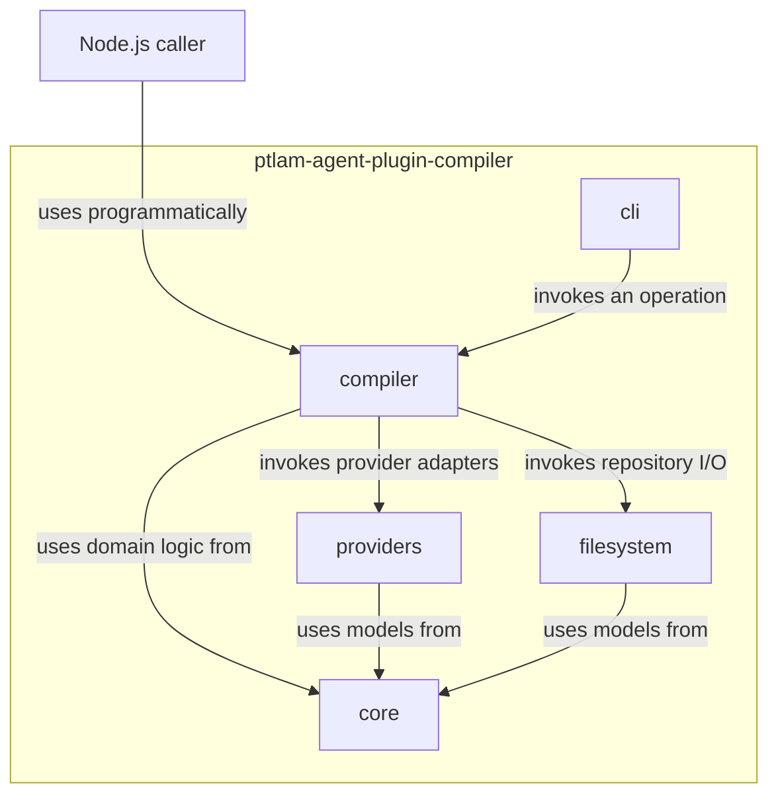
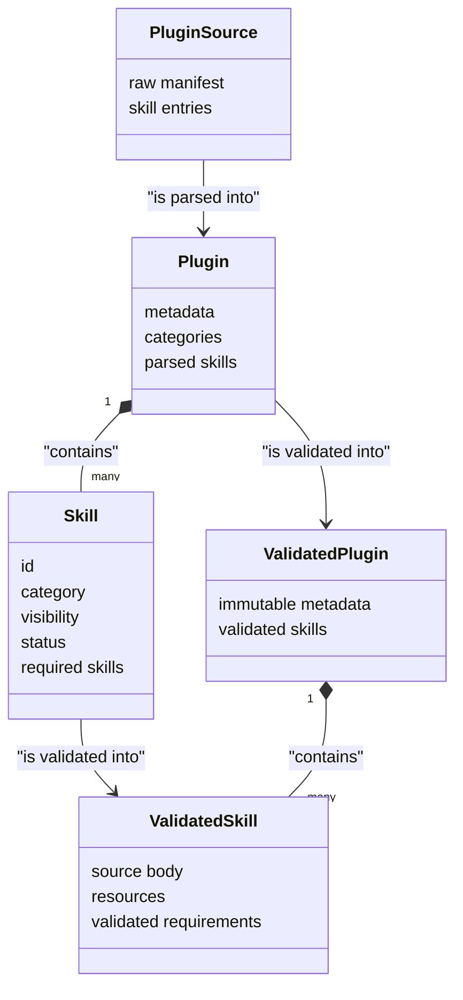
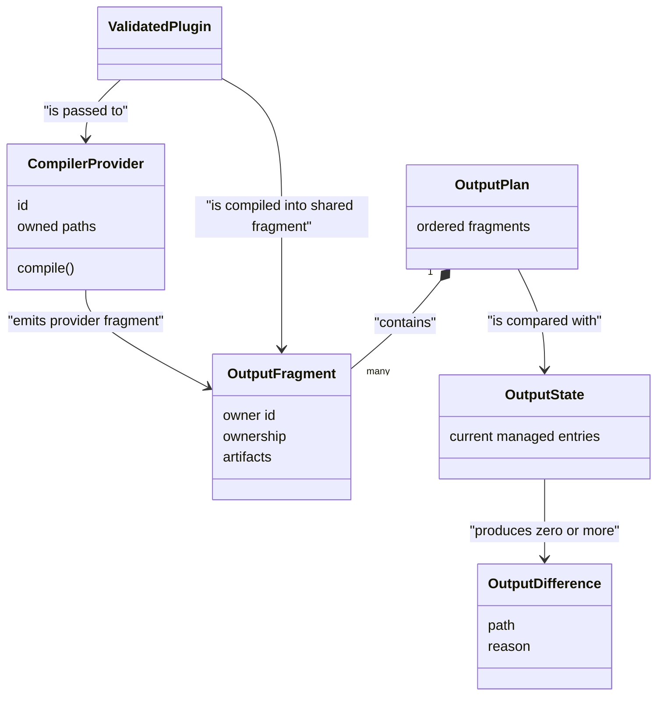
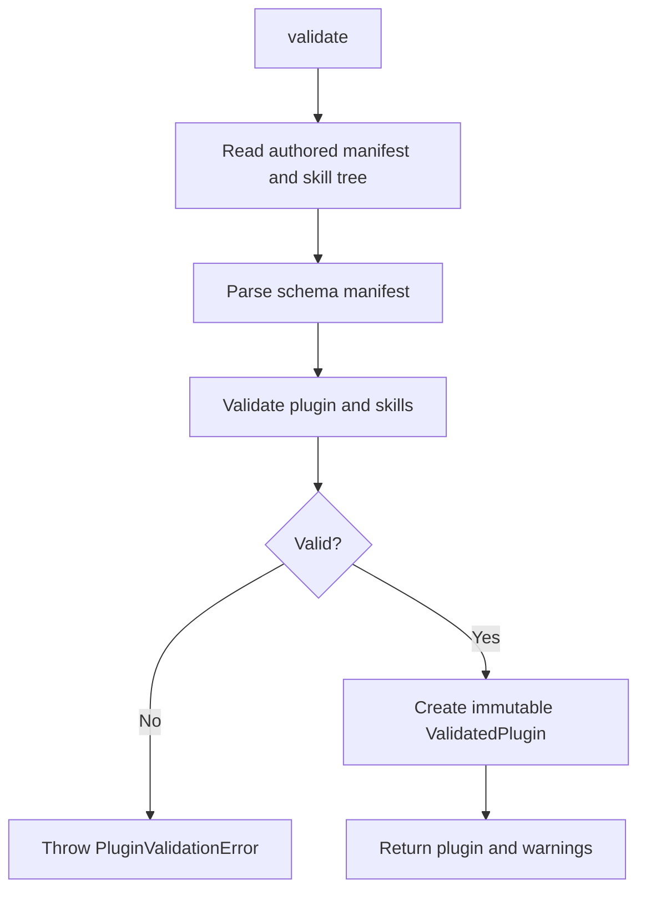
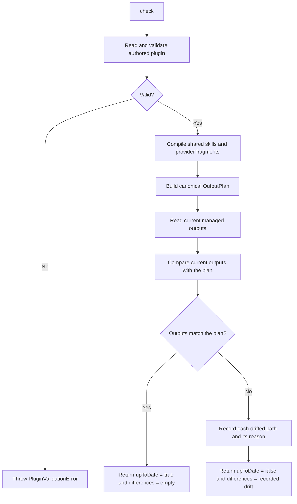
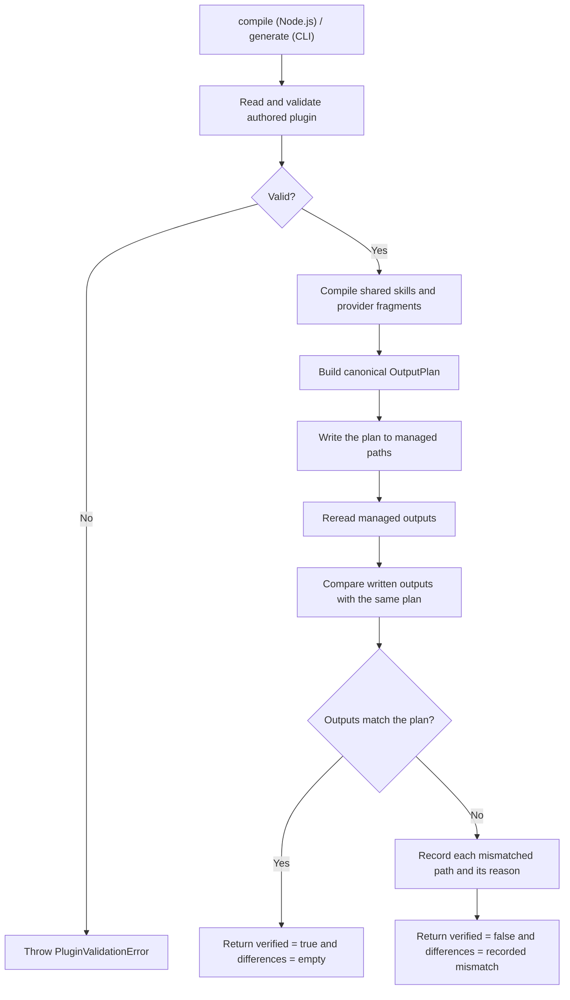

# Architecture

The Agent Plugin Compiler turns one authored plugin into validated, repeatable
Claude and Codex files. It validates and compiles a repository; it does not
install or publish plugins.

Read this document from top to bottom. Each section adds one level of detail:
modules, domain models, and operation flows.

## Architecture at a glance

| Module       | Interface seen by its caller                             | Main responsibility                                     | Internal modules known      |
| ------------ | -------------------------------------------------------- | ------------------------------------------------------- | --------------------------- |
| `CLI`        | Commands, arguments, reports, and exit codes             | Translate terminal input and output                     | Compiler                    |
| `Compiler`   | `AgentPluginCompiler.validate`, `.check`, and `.compile` | Coordinate one complete operation                       | Core, Providers, Filesystem |
| `Core`       | Validation, compilation, planning, comparison            | Apply deterministic domain rules without repository I/O | Core only                   |
| `Providers`  | `CompilerProvider.compile`                               | Render host-specific files from one validated plugin    | Core                        |
| `Filesystem` | Source reader, output reader, and plan writer            | Keep repository access safe and ownership-aware         | Core                        |

The same output plan is used by `check` and the writing operation (`generate` in
the CLI, `compile` in Node.js). This keeps dry checks and written files aligned.

## Dependency rules

| Rule                                          | Consequence                                                                                |
| --------------------------------------------- | ------------------------------------------------------------------------------------------ |
| The Compiler owns operation order.            | CLI and adapters do not duplicate workflows.                                               |
| Core owns domain policy and models.           | Validation, planning, and comparison remain independent of disk access and host selection. |
| Providers are adapters at one seam.           | Claude and Codex can vary without changing the Compiler workflow.                          |
| Filesystem is the only repository-I/O module. | Core and Providers operate on snapshots and plans, not absolute paths or live files.       |
| Callers use public seams only.                | Internal module layout can change without becoming a package compatibility promise.        |

The package root exports only `AgentPluginCompiler`, `Provider`, compiler
options, and operation result types. The five components above are private and
are not supported package subpaths.

## Domain model

### Authored plugin

| Model                                | Meaning                                                                           | Exists when                                                                      |
| ------------------------------------ | --------------------------------------------------------------------------------- | -------------------------------------------------------------------------------- |
| `PluginSource`                       | Immutable filesystem facts: raw manifest bytes and entries below `plugin/skills/` | Authored files have been read                                                    |
| `Plugin` / `Skill`                   | Strictly parsed schema values                                                     | YAML and schema parsing succeeded                                                |
| `ValidatedPlugin` / `ValidatedSkill` | Deeply immutable, provider-neutral data safe to compile                           | Graph, lifecycle, source layout, resources, and Markdown links passed validation |
| `SkillRequirement`                   | A directed dependency from one skill to another, with composition instructions    | The manifest declares `required_skills`                                          |
| `SkillResource`                      | Bytes copied with a skill, such as an agent, asset, reference, or script          | The matching source entry passed validation                                      |

### Planned output

| Model              | Meaning                                                                 |
| ------------------ | ----------------------------------------------------------------------- |
| `OutputFragment`   | Artifacts emitted by one owner: shared skills, Claude, or Codex         |
| `OutputOwnership`  | Either one complete tree or an exact set of files managed by a fragment |
| `OutputPlan`       | Canonical, collision-checked combination of all selected fragments      |
| `OutputState`      | Current entries read only from paths owned by the plan                  |
| `OutputDifference` | Missing, unexpected, changed, or wrong-kind managed path                |

> The `OutputPlan` is the central handoff.
>
> The `core` module builds it, `filesystem` reads or writes only its ownership,
> and `core` compares it with `OutputState`.

## Operation flows

### Validate

### Check

Each difference identifies one managed path as missing, unexpected,
content-changed, or the wrong filesystem kind.

### Compile (`generate` in CLI)

A full compilation is not one disk-wide transaction. If a later write fails, fix
the disk problem and run `compile` again (or `generate` through the CLI). Run
only one compiler operation at a time for a repository.
