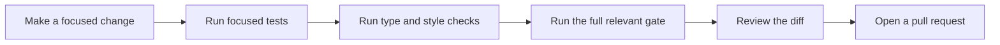

# Development

## Setup

The project uses npm and Node.js `>=22.6.0`. `.nvmrc` holds the normal local
version.

```bash
nvm use
npm ci
```

Use npm for this repository. The lockfile is the source of truth for installed
versions.

## Daily workflow



Keep source and tests in the same change. Do not edit `dist/`; it is build
output.

## Project map

| Path                     | Contents                                                    |
| ------------------------ | ----------------------------------------------------------- |
| `src/core/`              | Models, validation, shared compilation, and output planning |
| `src/providers/`         | Claude and Codex output adapters                            |
| `src/filesystem/`        | Safe reads, output inspection, and recoverable writes       |
| `src/compiler/`          | Public `PluginCompiler` orchestration                       |
| `src/cli/`               | Command parsing and terminal output                         |
| `scripts/`               | Small build and packed-package checks                       |
| `.github/`               | CI and release automation                                   |
| `tests/plugin-compiler/` | Unit, integration, and provider conformance tests           |

## Commands

| Command                  | Use                                       |
| ------------------------ | ----------------------------------------- |
| `npm run code:typecheck` | Check TypeScript without writing files    |
| `npm run code:check`     | Check formatting and code rules           |
| `npm run code:format`    | Apply code formatting                     |
| `npm test`               | Run all Vitest tests                      |
| `npm run test:package`   | Smoke-test one packed `.tgz` in isolation |
| `npm run build`          | Create and verify `dist/`                 |
| `npm run markdown:check` | Check Markdown format and rules           |

Run one test area while editing:

```bash
npm test -- tests/plugin-compiler/unit-tests/core
```

## Test layers

| Layer       | Proves                                                |
| ----------- | ----------------------------------------------------- |
| Unit        | One rule or pure module                               |
| Integration | Real boundaries between compiler, disk, and CLI       |
| Conformance | Claude and Codex output matches their owned contracts |
| Package     | The packed tarball installs, imports, and runs        |

Place a test at the lowest layer that can prove the behavior. Use real disk and
process boundaries only when those boundaries matter.

## Common change paths

| Change              | Update together                                                   |
| ------------------- | ----------------------------------------------------------------- |
| Manifest rule       | Schema, Core model, validation, fixtures, and tests               |
| Generated skill     | Shared compiler, plan tests, and provider conformance tests       |
| Provider file       | Provider, unit test, and provider conformance test                |
| Filesystem behavior | Filesystem code and real-filesystem integration tests             |
| Public API          | Package-root exports, declarations, integration tests, and README |
| CI or release flow  | Keep the workflow readable and exercise its commands locally      |

## Before review

```bash
npm run code:typecheck
npm run code:check
npm test
npm run markdown:check
git diff --check
```

Before publishing, pack once and exercise that exact tarball:

```bash
tarball="$(npm pack --ignore-scripts)"
npm run test:package -- "${tarball}"
```
