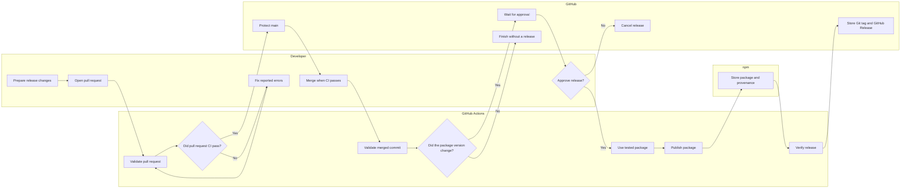
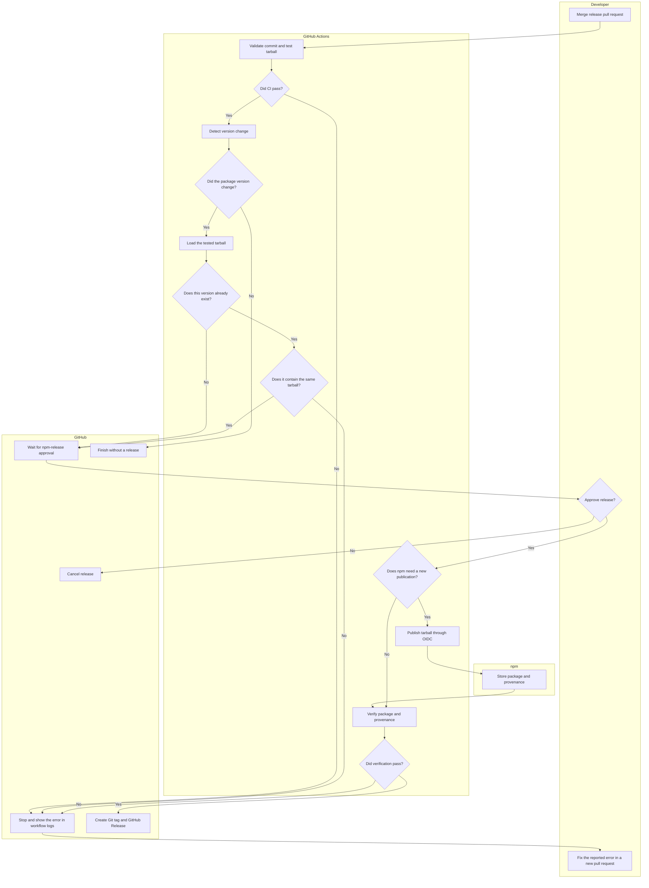

# Release

This guide lists only the actions a developer performs to release the package.
CI/CD handles validation, publishing, verification, the Git tag, and the GitHub
Release.

## Release at a glance



The developer prepares, reviews, merges, and approves the release. Everything
else is automatic.

## Developer steps

### 1. Prepare the release changes

Create a branch from the latest `main`.

Make the required code or documentation changes. Set the new version in
`package.json` and keep `package-lock.json` in sync. For example:

```bash
npm version 0.1.0-alpha.2 --no-git-tag-version
```

Use:

| Release stage | Version example | npm tag  |
| ------------- | --------------- | -------- |
| Alpha         | `0.1.0-alpha.2` | `next`   |
| Beta          | `0.1.0-beta.1`  | `next`   |
| RC            | `0.1.0-rc.1`    | `next`   |
| Stable        | `0.1.0`         | `latest` |

Do not check npm or Git tags manually. Do not run release validation locally. CI
performs those checks.

### 2. Open the release pull request

Commit the required changes, push the branch, and open a pull request against
`main`. Use lower case after the commit type, for example
`chore: prepare v0.1.0-alpha.2 release`.

CI automatically checks:

- package name and version metadata;
- whether a changed version already exists on npm or in Git;
- types, formatting, and documentation;
- build and tests; and
- the exact package artifact in a clean consumer.

If a check fails, use its logs to find the problem. Push the fix to the same
pull request. CI runs again.

Do not repeat successful CI checks manually.

### 3. Merge the pull request

Review and merge the pull request after all required checks pass.

No manual verification is needed after the merge. A package version change on
`main` automatically starts the release flow after CI validates the merged
commit. A change without a new version does not start a publication.

### 4. Approve the release

GitHub pauses the release at the protected `npm-release` environment. The
approval request shows the commit that will be released.

Approve the release when GitHub requests approval. The remaining work is
automatic. A successful workflow completes the release; no extra developer
action is required.

### If CI/CD fails

- For a temporary infrastructure error, rerun the entire CD workflow. This
  refreshes npm state before deciding whether publication is still needed.
- For a code, package, or configuration error after merge, prepare a new version
  in a new pull request. Merging it starts a new release flow.

Do not publish, verify npm, create a Git tag, or create a GitHub Release
manually.

## What happens under the hood

After the release pull request is merged, CI/CD:

1. validates the merged `main` commit and detects the version change;
2. checks the version, npm state, Git tag, and safe-resume conditions;
3. builds, tests, and stores the exact package tarball as a CI artifact;
4. starts the release flow only after the merged commit passes CI;
5. waits for protected environment approval;
6. publishes or safely resumes that tested tarball through npm OIDC;
7. verifies npm version, integrity, shasum, tag order, provenance, and
   signatures;
8. creates an annotated Git tag for the released commit; and
9. creates the matching GitHub prerelease or stable Release.



Prereleases use the npm tag `next` and create a GitHub prerelease. Stable
versions use `latest` and create a normal GitHub Release.

The workflow is safe to rerun. If npm already contains the same tarball, CI
verifies its integrity and continues without publishing it again. If the bytes
are different, the workflow stops.

## Optional: update a consumer

Consumer adoption is separate from this release. When needed, update the
consumer to the exact released version and push a pull request. Consumer CI
performs its validation. Fix only errors reported by CI, and merge when its
required checks pass.

Do not depend on the floating `next` tag in a maintained consumer.

## Rules

- Never publish the package locally.
- Never check or verify npm manually as part of the release flow.
- Never create or move a release Git tag manually.
- Never create the GitHub Release manually.
- Fix failures through a pull request and CI.
