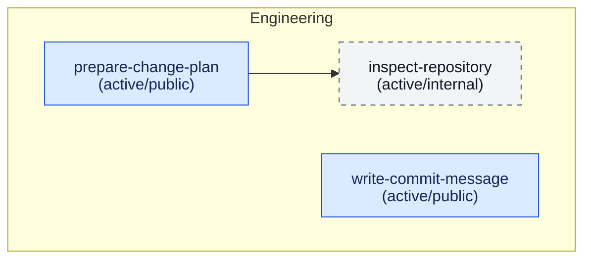

## Available Skills

Arrows point from a dependent skill to the skill it requires.

| Skill                  | Category    | Description                                                                                                                     | Visibility | Status | Replacement |
| ---------------------- | ----------- | ------------------------------------------------------------------------------------------------------------------------------- | ---------- | ------ | ----------- |
| `prepare-change-plan`  | Engineering | Create a focused implementation plan for a repository change. Use when the user asks how to implement a scoped codebase change. | public     | Active | —           |
| `write-commit-message` | Engineering | Write a concise Conventional Commit message from a change summary or diff. Use when the user asks for a commit message.         | public     | Active | —           |
