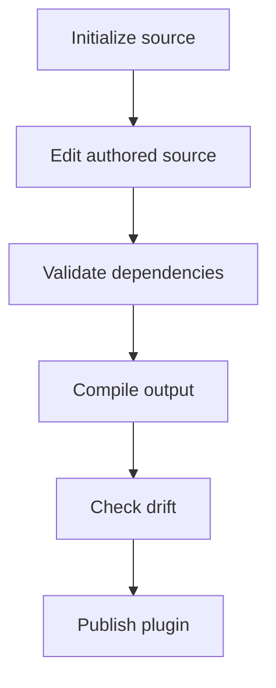

# Introduction

Agent Plugin Compiler turns dependency-aware skill sources into checked,
self-contained output that users can install with confidence.

## The problem it solves

Suppose a plugin publishes two skills:

```text
skills/
├── skill-a/  # requires skill-b
└── skill-b/
```

This creates two recurring problems:

1. **Users can install an incomplete skill.** Installers often present a flat
   catalog, so someone can install `skill-a` without knowing that `skill-b` is
   required.
2. **Authors can break dependencies silently.** If `skill-b` is renamed,
   archived, or deleted, hard-coded instructions in `skill-a` can become stale.

Relying on humans or AI agents to keep every repeated reference synchronized is
not a reliable publication process. The compiler makes dependencies explicit,
validates missing, circular, and invalid edges, and embeds every required skill
inside the public skill that needs it.

If both skills are public, the dependency remains independently installable and
is also nested inside its parent:

```text
skills/
├── skill-a/
│   ├── SKILL.md
│   └── skills/
│       └── skill-b/
│           └── SKILL.md
└── skill-b/
    └── SKILL.md
```

If `skill-b` is an internal building block, it is nested where required but is
not published as a standalone skill:

```text
skills/
└── skill-a/
    ├── SKILL.md
    └── skills/
        └── skill-b/
            └── SKILL.md
```

In both cases, a user can install `skill-a` by itself and receive everything it
needs. The same validated plugin model also generates deterministic manifests
for every selected provider.

## When it is a good fit

Use the compiler when a repository publishes agent skills and needs one or more
of these guarantees:

- dependencies must be visible and validated before publication;
- public skills must include the instructions they require;
- several host manifests must reflect the same plugin metadata;
- generated state must be reproducible in local development and CI.

## The authored source and generated result

The compiler gives the complete plugin one explicit source:

- `plugin/plugin.yml` declares plugin metadata, providers, categories, skills,
  visibility, lifecycle status, and dependency edges;
- `plugin/skills/<skill-id>/SKILL.md` contains the authored instructions;
- `skills/**` contains generated, self-contained public skills;
- provider adapters emit the selected host manifests.

## The authoring loop



1. `init` creates missing starter paths without replacing existing content.
2. You edit only the authored manifest and skill sources.
3. `validate` checks the manifest, source files, Markdown links, and dependency
   graph without inspecting generated output.
4. `compile` reconciles compiler-owned output and verifies the result from a
   fresh filesystem snapshot.
5. `check` compares current output with the desired plan without writing.

## Authored and generated files stay separate

Treat `plugin/**` as source and compiler-managed output as a build result. Do
not fix a generated skill or provider manifest by hand: update the authored
source and run `compile` again.

The compiler owns the complete root `skills/` tree and exact manifest paths for
the built-in providers. Files outside those declared paths remain outside its
write plan.

Next: [install the compiler](/guide/installation), or inspect the
[contract overview](/reference/).
